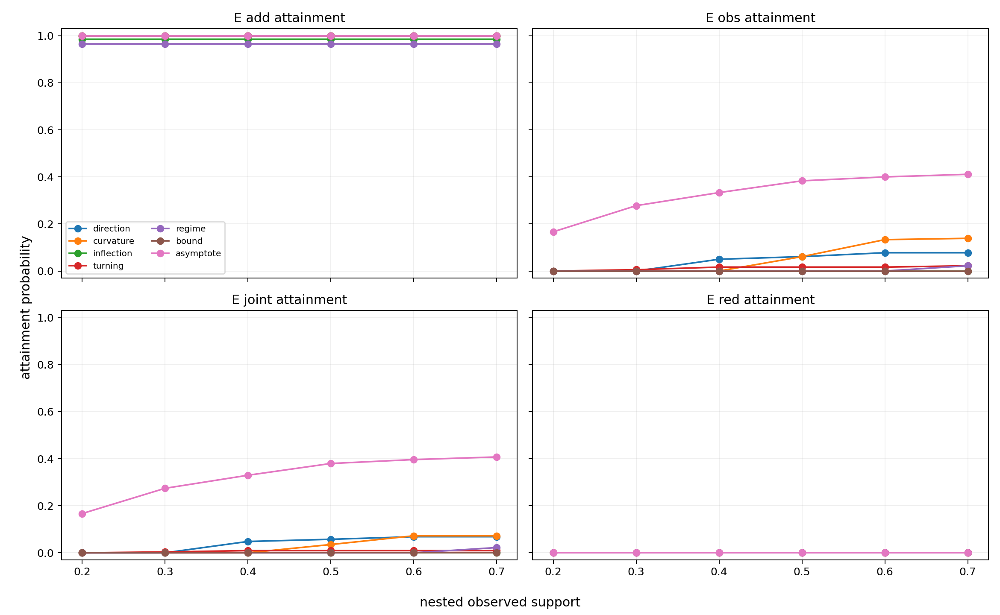
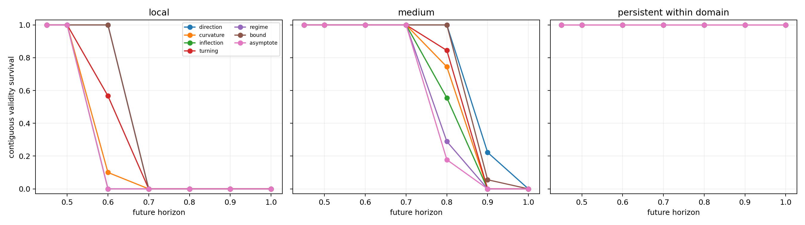
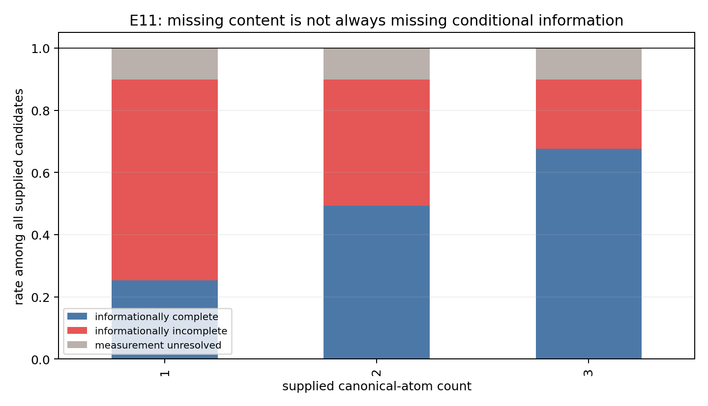
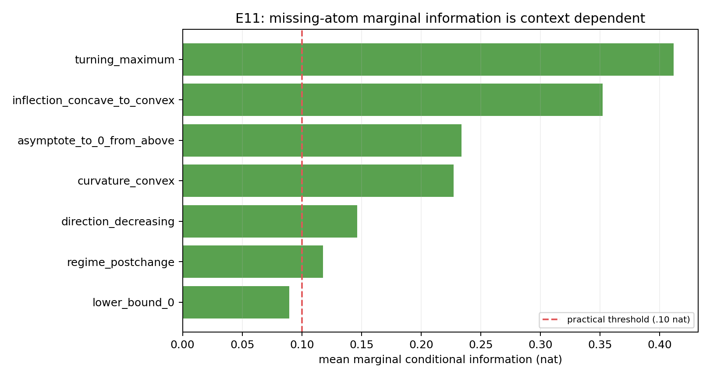
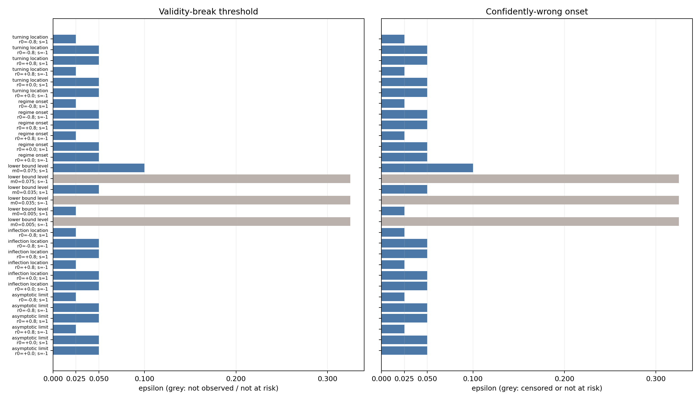
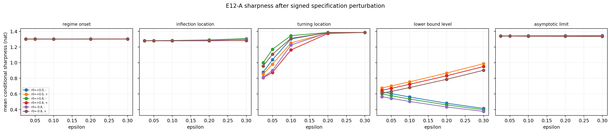

# Experiment notebook — generic structural-prior extrapolation

> **Purpose.** This is the living scientific log for this repository. It does
> not replace frozen protocols or machine-readable results. After every
> experiment, add (1) the question inherited from the prior result, (2) what
> was held fixed and manipulated, (3) the observed result including negative
> evidence, (4) the supported and unsupported claims, and (5) the precise next
> uncertainty. This prevents a collection of plots from becoming a post-hoc
> story.

## Current research thesis

```text
Retrieve plausible structural knowledge
→ constrain its extrapolative realization
→ admit it only when remaining uncertainty is safe
→ far-OOD extrapolation
```

The working prior is not merely a family label. It has three components:

```text
P = { family, ψ: realization constraints, q: confidence / uncertainty }
ψ may contain onset, scale, shape, bound, or intervals/distributions over them.
```

The central causal chain under investigation is:

```text
Family truth → Structural evidence → Parameter identifiability
             → Safe realization → Utility
```

`O` is always interpreted **within a family** as an exposure coordinate. Equal
numeric values of `O` do not imply equal absolute information across families.

---

## 0. Study rules and vocabulary

### What is being evaluated

- **Generative-family oracle:** receives only the true structural family; all
  realization parameters are fitted from the observed prefix.
- **Parameter oracle:** receives the family plus predeclared consequential
  realization parameters; remaining nuisance parameters are fitted.
- **Full-information oracle:** receives the complete generator and is an
  upper-bound reference, not a deployable method.
- **Admission:** must estimate `P(U_P > 0 | D_obs)`, not whether the family is
  true in the world.

### Status conventions

- **Development:** mechanism discovery or rule construction. Do not call it a
  confirmation result.
- **Frozen confirmation:** a previously locked rule on independent draws.
- **Negative result:** a prespecified statement did not hold. Keep it; do not
  tune it away.

Full definitions and legacy-key mappings are in [TERMINOLOGY.md](TERMINOLOGY.md).

---

## Literature grounding - why fit error alone is not enough

These papers are **external methodological grounding**, not independent
validation of this repository's synthetic claims. They motivate what should be
measured and constrained; our own experiments establish the specific
observability, identifiability, and realization findings below.

### A. Symbolic regression: accuracy must be traded against complexity

Harry Desmond's recent work on exhaustive symbolic regression and MDL frames
selection as an accuracy-complexity trade-off: highly complex likelihood-maximizing
expressions can overfit and generalize or extrapolate poorly. It treats the
accuracy-complexity plane as a Pareto problem rather than selecting by MSE alone.

- Desmond, H. (2026). *[Exhaustive Symbolic Regression and model selection by
  minimum description length](https://doi.org/10.1098/rsta.2024.0584)*,
  Philosophical Transactions of the Royal Society A.

**Use in this project.** Prefix fit cannot be the selection criterion for an
extrapolative prior. We therefore retain far-OOD utility, parameter
identifiability, and realization-gap measures alongside fit quality. This paper
does not imply that our particular family priors or complexity measures are
optimal.

### B. Shape constraints: structural validity and pointwise loss are separate objectives

Haider et al. study shape-constrained multi-objective symbolic regression under
noise and extrapolation. Their constrained search treats prediction error and
constraint violation separately; they report a low-noise setting where enforcing
shape constraints increases training prediction error while slightly lowering
test error. They also note that guaranteed constraints can restrict the search
space and affect accuracy.

- Haider, C., de Franca, F. O., Burlacu, B., & Kronberger, G. (2023).
  *[Shape-constrained multi-objective genetic programming for symbolic
  regression](https://doi.org/10.1016/j.asoc.2022.109855)*, Applied Soft
  Computing, 132, 109855.

**Use in this project.** It supports reporting structural/derivative validity
separately from pointwise RMSE, and motivates the acceleration robustness check
with constrained spline and neural-basis realizations. It is not evidence that
any shape constraint is beneficial when its scientific premise is wrong or
unobservable.

### C. Derivative-aware learning: values and derivatives encode different information

Sobolev Training augments value matching with target derivative matching. The
authors give theory and experiments in which derivative supervision improves
data efficiency and generalization in their studied settings.

- Czarnecki, W. M., Osindero, S., Jaderberg, M., Swirszcz, G., & Pascanu, R.
  (2017). *[Sobolev Training for Neural
  Networks](https://proceedings.neurips.cc/paper_files/paper/2017/hash/758a06618c69880a6cee5314ee42d52f-Abstract.html)*,
  NeurIPS 2017.

**Use in this project.** It is methodological precedent for recording slope,
curvature, and derivative-sign consistency as evidence primitives, rather than
evaluating only function-value RMSE. It does not establish that Sobolev loss or
true derivatives are available in our deployment setting; our current pipeline
uses prefix-derived structural evidence instead.

### D. Distance from training support: OOD risk and uncertainty are deployment variables

Distance from the observed/training support is a separate source of risk from
whether a structural mechanism has become visible in the prefix. Meyer and
Pebesma define a dissimilarity index as a weighted distance from a prediction
point to the training data in predictor space, and use it to delimit an *area
of applicability*. Their central warning is that cross-validation error is not
automatically applicable outside that support.

- Meyer, H., & Pebesma, E. (2021). *[Predicting into unknown space? Estimating
  the area of applicability of spatial prediction
  models](https://doi.org/10.1111/2041-210X.13650)*, Methods in Ecology and
  Evolution, 12(9), 1620–1633.

Tossou et al. independently construct molecular regression OOD settings and
report that performance and calibration deteriorate as test/deployment examples
move farther from the training distribution. They argue that train-to-deployment
distance should be represented in evaluation and deployment decision-making.

- Tossou, P., Wognum, C., Craig, M., Mary, H., & Noutahi, E. (2024).
  *[Real-World Molecular Out-of-Distribution: Specification and
  Investigation](https://doi.org/10.1021/acs.jcim.3c01774)*, Journal of
  Chemical Information and Modeling, 64(4), 1012–1025.

**Use in this project.** Let `O` denote *mechanism exposure* inside the
observed prefix (for example, post-onset evidence), and let `d` denote the
distance of an evaluation/deployment query beyond the support boundary. They
must not be conflated: a mechanism can be highly observable (`O` high) while a
farther query still has larger continuation risk. The current synthetic tail
keeps its far-OOD region fixed, so it demonstrates an `O → utility` relation;
it does **not** yet estimate a `d → utility` curve.

### E. Extrapolation-aware validation: interpolation and extrapolation select differently

Garcia and Naets introduce Leave-Boundary-Out (LBO) splitting specifically to
select regression models for extrapolation. Across their benchmark they find an
interpolation–extrapolation trade-off, and the models selected with
extrapolation considered are often simpler than those selected under standard
splits (with the precise pattern model-class dependent).

- Garcia, M., & Naets, F. (2025). *[Beyond Limits: Enhancing the
  Extrapolation Performance of Regression Models by Leaving the Boundary
  Out](https://doi.org/10.1007/s10994-025-06933-8)*, Machine Learning.

**Use in this project.** This supports treating a boundary/leave-out-tail
protocol as a model-selection instrument rather than evaluating only random
interpolation-style splits. It does not claim that a simpler realization is
always better; complexity must be judged jointly with held-out continuation
utility and structural validity.

### Consequence for the experimental record

Every future experiment should distinguish at least four layers:

```text
prefix fit / function-value error
structural or derivative validity
parameter identifiability and realization uncertainty
distance from support (d) and uncertainty/calibration
far-OOD utility and harm risk
```

This makes a model that fits a prefix well but has an implausible continuation
visible as a separate failure mode, rather than hiding it in one aggregate score.

---

## 1. Generic observability sweep — the starting phenomenon

**Question inherited from the initial feasibility check.** If the matching
structural family is true, is it always useful for far-OOD extrapolation?

**Design.** Three generic families—regime change, emergent curvature, and
asymptotic bound—were exposed to different degrees before the fixed boundary.
The matching generative-family prior was fit only on a noisy prefix and compared
with an affine fallback on a clean withheld tail.

**What we observed.** In all three families, low exposure could make a matching
family prior harmful; utility increased as the family-defining behavior became
visible. The pooled observability–utility association was strongly positive
(`Spearman ρ=.726` in the later, broader sweep), but not deterministic.

**What this established.**

```text
Prior truth ≠ prior observability ≠ prior utility.
```

**What it did not establish.** It did not tell us whether a useful prior could
be recognized from the prefix, nor why a true family could fail.

**Next question generated.** Can admission use prefix-only evidence to prevent
harmful matching priors from being deployed?

**Artifacts.** `RESULTS_V1.md`, `results/generic_observability_sweep_v1/`,
`figures/fig01_observability_to_utility.png`.

---

## 2. Admission-v2 development — utility-aware safety screening

**Question inherited from the observability sweep.** Does prefix evidence
separate useful from harmful realizations better than a simple pseudo-OOD gate?

**Design.** A 4,500-task development grid used boundary, structural,
stability, and identifiability evidence. A fixed logistic rule targets the sign
of clean-tail utility. `O_true` is analysis-only and never enters the feature
matrix.

**What we observed.** Relative to v1, v2 reduced harmful false admission from
`65.0%` to `20.9%`, while coverage changed from `63.3%` to `56.3%` and useful
prior admission improved from `62.4%` to `76.8%`.

**What this established.** The evidence primitives could discriminate harmful
from useful fitted priors in held-out development seeds; this was not explained
solely by rejecting everything.

**What it did not establish.** Development tuning is not independent evidence.

**Next question generated.** Does the frozen rule reproduce on fully disjoint
draws without feature, normalization, threshold, or label changes?

**Artifacts.** `ADMISSION_V2_PROTOCOL.md`, `RESULTS_ADMISSION_V2.md`.

---

## 3. Frozen admission-v2 confirmation — the safety finding reproduces

**Question inherited from v2 development.** Is the safety gain robust on new
random seeds, parameter draws, and noise realizations?

**Design.** The protocol, source, configuration hashes, classifier, and `.50`
threshold were frozen before an independent 4,500-task confirmation grid.
Primary endpoint: harmful false-admission rate (FAR).

**What we observed.** FAR fell from `63.98%` (v1) to `19.28%` (v2), paired
`ΔFAR=-.4469`, 95% CI `[-.4785, -.4166]`. Coverage changed `62.16%→56.02%`,
useful-prior admission `61.10%→77.27%`, and admitted-set harm risk
`37.72%→12.61%`.

**Qualification retained.** For the asymptotic-bound family, FAR rose because
harmful cases are rare, though admitted-set harm risk fell and useful-prior
admission increased. Pooled evidence must not hide this family-level nuance.

**What this established.** Admission can be framed as a reproducible
utility-aware safety decision, rather than a family-truth classifier.

**Next question generated.** What makes a matching family realization harmful
when the family itself is known to be true?

**Artifacts.** `FROZEN_ADMISSION_V2_MANIFEST.json`,
`RESULTS_ADMISSION_V2_CONFIRMATION.md`,
`figures/fig08_confirmation_coverage_harm_risk.png`.

---

## 4. Oracle decomposition — family truth is not realization knowledge

**Question inherited from confirmation.** Why can extrapolation fail despite
knowing the correct structural family?

**Design.** On identical synthetic tasks, compare affine fallback,
generative-family oracle, parameter oracle, and full-information oracle.
The parameter oracle receives onset, post-onset scale, and exponent for regime
change/curvature; asymptotic bound receives its true lower limit.

**What we observed.** At low exposure, the matching family prior was much worse
than fallback (e.g., regime `0.097–0.110` vs fallback `0.014–0.034`), while the
parameter oracle was approximately `.003`. Emergent curvature replicated this
pattern. For asymptotic bounds, family-only performance became excellent only
when the saturation behavior was strongly exposed. Three acceleration
realizations—power law, constrained spline, constrained neural basis—also
showed low-exposure harm, ruling out a power-law-only explanation.

**What this established.**

```text
Structural truth ≠ knowledge of extrapolative realization.
```

The failure is consistent with uncertainty in consequential continuation
parameters, not family misspecification.

**Qualification retained.** At the original maximum `O=.533`, family-only had
not converged to the parameter oracle. Visibility and identifiability remained
separate; this was not yet evidence that longer exposure could never close the
gap.

**Next question generated.** Does substantially more post-onset exposure make
family-only realization parameters identifiable from data alone?

**Artifacts.** `ORACLE_DECOMPOSITION_PROTOCOL.md`,
`RESULTS_ORACLE_DECOMPOSITION_V1.md`, `figures/fig09_*`, `figures/fig10_*`.

---

## 5. Exposure / identifiability extension — more exposure helps but does not close the gap

**Question inherited from oracle decomposition.** Does extended observation of
a true structural behavior make its extrapolative realization identifiable from
data alone?

**Design.** Regime change and emergent curvature only; new independent draws;
`O=.533, .60, .70, .80, .90`; 250 tasks per family-level. Primary endpoint is
the paired realization gap:

```text
G = RMSE(generative-family oracle) − RMSE(parameter oracle).
```

The pre-result practical-convergence rule was upper paired bootstrap 95% CI of
`G <= .01`. Mechanism records track onset, scale, and exponent errors.

**What we observed.** Both family-only error and realization-parameter error
decreased with exposure, but practical convergence did not occur.

| Family | G at O=.533 | G at O=.90 | 95% CI at O=.90 | Result |
|---|---:|---:|---:|---|
| Regime change | .0675 | .0346 | [.0310, .0383] | Not converged |
| Emergent curvature | .0687 | .0438 | [.0382, .0494] | Not converged |

At the same `O=.90`, family knowledge was valuable: family-only RMSE was `.0362`
versus fallback `.1816` for regime change, and `.0477` versus `.1173` for
curvature. Parameter error also fell, so more exposure improves realization
quality and utility without making external realization knowledge dispensable
in the tested grid.

**What this established.**

```text
Visible ≠ identifiable.
Family knowledge is valuable, but not sufficient in this tested setting.
```

**What it does not establish.** It does not prove family labels are universally
or intrinsically insufficient. More support, a nearer tail, lower noise, or a
different generator could change the result.

**Next question generated.** Which parts of realization knowledge are valuable,
and how precise must that knowledge be before it improves far-OOD extrapolation?

**Artifacts.** `EXPOSURE_IDENTIFIABILITY_EXTENSION_PROTOCOL.md`,
`RESULTS_EXPOSURE_IDENTIFIABILITY_EXTENSION_V1.md`,
`figures/fig11_exposure_identifiability_extension.png`,
`figures/fig12_exposure_parameter_identification.png`.

---

## 6. Partial Realization Knowledge Sweep — the retrieval target is family-dependent

**Why this is next.** The parameter oracle is intentionally too strong to model
real scientific retrieval: RAG rarely returns exact onset, scale, and exponent.
Before building RAG, establish the minimum useful content and precision of
external knowledge. Otherwise a failed RAG result confounds retrieval failure,
missing realization fields, imprecise knowledge, and admission error.

**Primary question.**

> Which realization fields, supplied at which precision, close enough of the
> family-to-parameter gap to yield positive far-OOD utility?

### Frozen conditions

For each of regime change and emergent curvature:

1. Family only.
2. Each singleton: onset only, scale only, shape/exponent only.
3. Each pair: onset+scale, onset+shape, scale+shape.
4. All three fields (the existing parameter-oracle reference).
5. All three fields, exact (the parameter-oracle reference).

For each supplied field, distinguish exact knowledge from noisy or interval
knowledge. A starting onset-noise sweep is `σ_K ∈ {0, .02, .05, .10, .20}` for
`τ_known = τ + ε`, `ε ~ Normal(0, σ_K²)`. Corresponding scale and exponent
precision grids must be specified before the experiment runs.

### Execution result

The sweep ran at `O=.90` on 400 independent base trajectories (2 families ×
200), reusing each noisy prefix across all conditions. It produced 14,400
paired fits. Exact constraints show that no field has a universal ranking:

| Family | Strongest exact pair | Gap closed | Important counterexample |
|---|---|---:|---|
| Regime change | onset+scale | 97.7% [97.0, 98.2] | onset alone: 21.3% |
| Emergent curvature | scale+shape | 92.8% [90.5, 94.7] | onset alone: 3.6%, CI includes 0 |

Precision changes the result. The all-field condition is perfect only when
exact; for regime change it falls to 53% closure at `.05` retrieval noise and
below family-only at `.10`. Curvature tolerates moderate all-field uncertainty
better (68% at `.10`) but falls below family-only at `.40`. Therefore RAG must
return constraints **and their uncertainty**, rather than be treated as a
point-parameter oracle.

### Outputs now recorded

- Far-OOD RMSE and utility versus fallback for every knowledge subset.
- Incremental gap closure relative to family-only and full parameter knowledge.
- Knowledge precision → utility curves, with intervals over fresh random draws.
- Family-specific ranking of onset, scale, and shape information.
- An uncertainty-aware ontology recommendation:

```text
Structural family
└── realization constraints: onset, scale, shape, bound
    └── uncertainty / confidence / provenance
```

### Decision and next question

- Retrieval schema: family plus onset, scale, shape, and an uncertainty/confidence
  field. The evidence priority is onset+scale for regime change and scale+shape
  for curvature in this generator.
- Admission should be prior-conditioned, `A(P, D_obs)`, because both valuable
  fields and tolerance to imprecision differ by family.
- Next step before actual retrieval: freeze a **RAG information specification**
  that describes what an item must return (field, constraint/range, confidence,
  provenance) and how uncertain constraints enter realization fitting. Actual
  RAG can then be evaluated as candidate/constraint recall rather than an
  uninterpretable end-to-end black box.

**Artifacts.** `PARTIAL_REALIZATION_KNOWLEDGE_PROTOCOL.md`,
`RESULTS_PARTIAL_REALIZATION_KNOWLEDGE_V1.md`,
`results/partial_realization_knowledge_sweep_v1/results.json`,
`figures/fig13_partial_knowledge_exact_gap_closure.png`,
`figures/fig14_partial_knowledge_precision_sweep.png`.

---

## Update checklist for every future experiment

1. Add a frozen protocol before running; do not edit its scientific rule after
   observing results.
2. Add a dated entry above with question, manipulation, held-out information,
   primary endpoint, and status.
3. Report the strongest contrary or family-specific evidence, not only pooled
   improvements.
4. State what the result supports, what it does not support, and one next
   question that follows logically.
5. Record both mechanism exposure/observability (`O`) and query distance from
   support (`d`) when the design varies either one; do not use one as a proxy
   for the other without an explicit validation.
6. Link protocol, code, results JSON, figures, and any commit/hash.

---

## 7. Prior Evaluation Metric Experiment — selection is not only a value-fit question

**Question.** Can pseudo-OOD pointwise MSE select a structural-prior candidate
reliably as evaluation moves farther outside observed support, or do
direction/curvature/complexity metrics provide a better selection signal?

**Why this follows now.** The prior-realization results showed that a family
label does not determine a safe continuation. Before testing residual capacity
or knowledge specificity, we must ask whether the *selection metric* rewards
the appropriate candidate at all. This test explicitly separates structural
compatibility, realization quality, and far-OOD utility.

**Frozen manipulation.** Three existing generators × low/mid/high evidence ×
noise `.005/.015/.030` × 100 draws (2,700 tasks). Inner fit is `t <= .45`,
pseudo-OOD selection is `.45 < t <= .60`, candidates are refit on `t <= .60`,
and far-OOD bands are D1 `.70–.80`, D2 `.90–1.00`, D3 `1.20–1.30`. No composite
score was formed. Candidate metrics were MSE, first/second-difference cosine,
derivative-sign agreement, Spearman trend, and predictive BIC.

**Result.** MSE was the strongest value/shape-only selection rule, but
complexity-aware predictive BIC did better pooled: D3 regret `.0817`
`[.0769,.0869]` versus MSE `.0973` `[.0905,.1044]`, a 16.1% reduction, and
incompatible selections fell from 25.4% to 22.7%. Derivative-sign and Spearman
were safe in a narrow compatibility sense (0% incompatible selections) but
lost too much realization information: both had D3 regret `.1648` and 97.0%
pseudo-vs-far winner disagreement. Difference-cosine rules were worse and
selected incompatible candidates frequently.

**What it supports.** Pseudo-OOD MSE is not uniformly optimal for the fixed
candidate library; adding an explicit complexity penalty improved pooled
far-OOD selection. The result does **not** support replacing value fit with
derivative/trend matching alone. The BIC improvement is family-dependent:
asymptotic-bound settings drive much of it, while several high-exposure
regime-change cells favor MSE.

**Logical next question.** Is MSE sometimes selecting an incompatible prior
because that candidate has extra residual capacity that improves near-support
fit while concealing a poor structural continuation? E2 will compare MSE and
BIC under capacity-matched versus capacity-stress residual corrections.

**Artifacts.** [Frozen protocol](PRIOR_EVALUATION_METRIC_PROTOCOL_V1.md) ·
[result report](RESULTS_PRIOR_EVALUATION_METRIC_V1.md) ·
`experiments/prior_evaluation_metric_v1.py` ·
`results/prior_evaluation_metric_v1/results.json` ·
`figures/fig15_prior_metric_regret_by_distance.png` ·
`figures/fig16_prior_metric_selection_risk.png`

---

## 8. Model Capacity / Residual Stress Test — a falsified mechanism is still useful

**Question.** Does pseudo-OOD MSE prefer an incompatible structural candidate
only because a higher-capacity residual can improve near-support fit?

**Frozen manipulation.** E1's entire generator/support/selection contract was
retained. Each candidate was `prior + ridge-polynomial residual`. Compatible
candidates and neutral `P0` used four basis terms; incompatible candidates used
four, eight, or sixteen. E1's MSE and predictive BIC were the only selectors.
This is 2,700 base draws × 3 capacity ratios = 8,100 capacity cases.

**Result.** The proposed monotone masking pattern did not occur. MSE's
incompatible-selection rate fell from 36.0% at matched capacity to 3.8% at 2×
and 0% at 4×; BIC followed the same direction (34.3%, 2.0%, 0%). High-capacity
polynomial corrections were often sufficiently unstable already in pseudo-OOD
that both selectors rejected them. However, rare 2× selections produced severe
D3 regret: MSE `14.052 [10.706,17.594]`, BIC `7.986 [5.507,10.761]`. The
average selected residual/prior norm ratio was about `.07`, but the residual
changed first-difference direction about `.31` of pseudo-OOD steps.

**What it supports.** Residual capacity is itself a distance-dependent
realization risk, and BIC reduces the extreme failure in this stress setting.
It does **not** support the general causal claim that flexible residuals make
MSE select an incompatible prior more often. That claim stays open for spline
or neural corrections; it cannot be claimed from this result.

**Logical next question.** Even without the masking mechanism, how much prior
detail should a system use at each evidence level? E3 tests the independent
specificity hierarchy: weak constraints → family → family plus realization
intervals.

**Artifacts.** [Frozen protocol](RESIDUAL_CAPACITY_STRESS_PROTOCOL_V1.md) ·
[result report](RESULTS_RESIDUAL_CAPACITY_STRESS_V1.md) ·
`experiments/residual_capacity_stress_v1.py` ·
`results/residual_capacity_stress_v1/results.json` ·
`figures/fig17_residual_capacity_stress.png`

---

## 9. Prior Specificity Hierarchy — accurate external constraints can dominate exposure

**Question.** Is a more specific prior harmful when evidence is low, and useful
when evidence is high?

**Result.** Not under the specified L4 condition. L4 supplied the matching
family plus ±10% intervals on realization fields. It beat direction-only L1
even at low exposure: D3 `L4-L1` was −.1666 for regime change, −.1383 for
curvature, and −.0192 for bounds. At very high evidence, weak L1 had large
under-specificity costs: .4614, .3025, and .5386, respectively.

**Interpretation.** This is a boundary condition on the previous realization
claim, not a contradiction. Accurate external constraints can make a specific
prior useful before the structure is identifiable from the prefix. Therefore
the v1 hierarchy cannot support an “over-specificity always harms at low O”
claim. The next valid variant must vary interval calibration/width, rather than
assuming all L4 constraints are accurate.

**Artifacts.** [Frozen protocol](PRIOR_SPECIFICITY_HIERARCHY_PROTOCOL_V1.md) ·
[result report](RESULTS_PRIOR_SPECIFICITY_HIERARCHY_V1.md) ·
`experiments/prior_specificity_hierarchy_v1.py` ·
`results/prior_specificity_hierarchy_v1/results.json` ·
`figures/fig18_prior_specificity_hierarchy.png`

---

## 10. Prior Archetype Generalization — simple truth is not full realization

**Question.** Do selection failures persist when the only true shared prior is
monotonic direction, not a transition/curvature/bound function family?

**Result.** Yes for candidate selection. Across 900 random-monotone tasks, MSE
selected incompatible curvature/bound/transition candidates at D3 in 82.3%,
78.7%, and 72.0% of weak/medium/strong direction-SNR cases. BIC reduced these
to 64.7%, 47.3%, and 56.3%, with D3 regret `.0190–.0972` versus MSE
`.1388–.1715`. The direction-constrained affine prior itself had near-zero
point-forecast utility except under weak direction with high noise, where it
provided a small positive utility (`.00156 [.00065,.00272]`).

**Interpretation.** A simple true structural property need not determine a
future realization. Yet MSE can still reward spurious more-specific candidates;
complexity-aware selection reduces, but does not eliminate, the error. This
extends the selection phenomenon beyond the initial three complex archetypes.

**Artifacts.** [Frozen protocol](PRIOR_ARCHETYPE_GENERALIZATION_PROTOCOL_V1.md) ·
[result report](RESULTS_PRIOR_ARCHETYPE_GENERALIZATION_V1.md) ·
`experiments/prior_archetype_generalization_v1.py` ·
`results/prior_archetype_generalization_v1/results.json` ·
`figures/fig19_monotone_archetype_generalization.png`

---

## 11. Synthesis after E1–E4 — from truth to calibrated incremental information

The evidence does not support either “a true prior automatically improves
extrapolation” or “specific priors are unsafe whenever evidence is low.” The
current working decomposition is:

```text
prior truth
  ≠ incremental information beyond the baseline
  ≠ calibration of supplied realization knowledge
  ≠ realization from the available prefix
  ≠ far-OOD utility
```

E1 says value fit remains useful but complexity-aware predictive BIC improves
pooled selection; derivative/trend rules alone lose too much realization
information. E2 does not support polynomial residual masking as the mechanism
for MSE failure, although it exposes residual capacity as a distance-sensitive
risk. E3 establishes that accurate narrow realization intervals can be useful
even before data reveal the structure. E4 shows a true monotone direction can
add almost no forecast information if the affine baseline already learns it.

**Next falsifiable question (E5).** At fixed correct family, does narrow
knowledge become worse than broad knowledge as its calibration error increases?
This is the required test of *calibration × specificity*, and it introduces
`incremental prior information`: a prior is useful only if it adds reliable
information beyond what the baseline already encodes.

**Then E6.** Separately test `distance × residual trust`: how far a learned
data correction can be trusted after external-prior calibration has been
understood. These are two distinct trust axes: external knowledge calibration
controls prior trust; query distance controls residual trust.

**Artifact.** [E5 frozen protocol](PRIOR_CALIBRATION_SPECIFICITY_PROTOCOL_V1.md)

---

## 12. E5 Calibration × Specificity — calibration tolerance is family-dependent

**Question.** Holding the family true, when does a narrower realization
constraint stop being better than a broader one as its center becomes biased?

**Result.** Correct specificity orders as expected: pooled D3 utility rises
from family-only `.0732`, broad `.2061`, medium `.2293`, to narrow `.2498`;
harmful rate falls from 23.0% to 1.0%. Mild bias only slightly reduces narrow
utility (`.2404`), but strong bias lowers it to `.2015`, below pooled broad
correct (`.2061`). The reversal is clearest for asymptotic bounds (.2396 broad
correct vs .1833 narrow strong bias), absent for curvature at the tested error,
and nearly tied for regime change.

**What it supports.** Specificity and calibration are empirically distinct.
Accurate narrow knowledge can be useful before a structure is observable;
miscalibration erodes that gain. The tolerance is prior-family dependent, so
v1 cannot claim one universal crossover `e*`.

**What it does not yet test.** Admission-v2 has not been re-evaluated because
the frozen confirmation classifier artifact is not exported. Retraining on E5
would contaminate the intended generalization test. The correct next step is to
export that artifact, then score correct versus miscalibrated knowledge without
refitting; afterward E6 addresses distance × residual trust.

**Artifacts.** [Frozen protocol](PRIOR_CALIBRATION_SPECIFICITY_PROTOCOL_V1.md) ·
[result report](RESULTS_PRIOR_CALIBRATION_SPECIFICITY_V1.md) ·
`experiments/prior_calibration_specificity_v1.py` ·
`results/prior_calibration_specificity_v1/results.json` ·
`figures/fig20_prior_calibration_specificity.png`

---

## 13. E5b Calibration Tolerance — the vulnerable field depends on the family

E5b fixed narrow interval width and swept normalized center bias from `0` to
`.40` by field. Broad-correct was the comparator. First negative narrow-minus-
broad utility occurred at bound lower `.05`, curvature scale `.10`, curvature
scale+shape `.10`, regime scale `.10`, and regime onset `.15`; curvature shape
did not cross through `.40`, and regime onset+scale crossed only at `.40`.
At first crossovers, harm-versus-broad rates were already 56.7–63.3%.

**Conclusion.** Calibration tolerance is family-and-field-specific. An average
utility curve alone is insufficient: tail harm rises around the crossover.
This is the prior-trust axis needed before E6; the next orthogonal question is
how query distance controls trust in the data-driven residual.

**Artifacts.** [Frozen protocol](CALIBRATION_TOLERANCE_PROTOCOL_V1.md) ·
[result report](RESULTS_CALIBRATION_TOLERANCE_V1.md) ·
`experiments/calibration_tolerance_v1.py` ·
`results/calibration_tolerance_v1/results.json` ·
`figures/fig21_calibration_tolerance_curves.png`

---

## 14. Prior Quality Audit — coverage and sharpness are not utility

**Purpose.** Prior quality needs a structural measurement layer separate from
RMSE: (1) does the prior retain the true continuation, and (2) how much of the
prefix-consistent continuation space does it remove? This analysis reuses E5
conditions rather than introducing another predictive method.

**Definitions.** Structural coverage is membership of the true realization in
the supplied constraint. Structural sharpness is `-log` weighted survival mass
after sampling family continuation parameters and weighting them by observed-
prefix likelihood. The reference is therefore conditioned on data already
seen; it does not count prefix fit as prior information.

**Result.** Across 810 tasks, family-only has coverage 1.00 and sharpness 0.00;
broad-correct has 1.00 and 7.52; narrow-correct has 1.00 and 24.64. Narrow
mild/strong bias retains similarly high sharpness (25.07/25.93) but has zero
coverage. It is therefore structurally *confidently wrong*, despite being
highly restrictive.

**What it supports.** The useful taxonomy is Coverage × Sharpness, with utility
as a separate empirical outcome: true-but-uninformative, ideal, confidently
wrong, and useless. It explains why E5 calibration is required.

**Limit and next question.** This v1 ensemble is within the correct family, so
incremental information is sharpness relative to family-only. A later broader
ensemble is needed to measure what a prior adds beyond a baseline predictor.
E6 remains separate: it asks how distance affects trust in learned residuals.

**Artifacts.** [Protocol](PRIOR_QUALITY_AUDIT_PROTOCOL_V1.md) ·
[result report](RESULTS_PRIOR_QUALITY_AUDIT_V1.md) ·
`experiments/prior_quality_audit_v1.py` ·
`results/prior_quality_audit_v1/results.json` ·
`figures/fig23_prior_quality_audit.png`

---

## 15. Post-E6 roadmap — Prior-Space Stress Benchmark v1

**Motivation.** We should not claim that an LLM's broad pretraining makes its
priors trustworthy. The testable claim is narrower: can it propose a wider and
more useful candidate prior set than a closed handcrafted library, while a
separate evaluator rejects harmful proposals?

**Benchmark construction.** Define a compositional grammar of structural
primitives rather than enumerate a fixed list of formulas: direction, curvature
or curvature change, bound/asymptote, threshold/regime change, power scaling,
periodicity, memory/path dependence, interaction, shock/discontinuity, and
invariance/conservation. Sample one-to-three primitive compositions together
with support length, OOD distance, noise, density, identifiability, transition
exposure, local residual magnitude, and individual variation.

**Generalization strata.**

1. Seen primitive / unseen parameters — ordinary parameter generalization.
2. Seen primitives / held-out composition — compositional prior generalization.
3. Held-out primitive or mechanism — prior-space OOD.

**Proposal-engine comparison.** Fixed handcrafted library, symbolic/grammar
library, small learned proposer, LLM, and LLM+RAG. All outputs must be parsed
into one schema: family/primitives, realization constraints, uncertainty, and
provenance. The proposer is recall-oriented; admission remains deployment-
precision-oriented.

**Measures.** Candidate recall of useful priors; structural coverage;
conditional sharpness; realization calibration; proposal harm; diversity; and
unknown/abstain behavior under held-out mechanisms. Do not score an LLM only by
whether it names the generator label.

**Open-world requirement.** Some mechanisms will remain unknown. A valid system
must retain unknown/abstain mass and avoid forcing a sharp unsupported prior,
especially for precursor-free shocks. This is a benchmark target, not yet an
implemented LLM experiment.

**Research sequence.** Finish E6 residual-trust phenomenon and the already
frozen Coverage–Sharpness association analysis; then build this benchmark before
testing actual LLM/RAG candidate generation.

---

## 16. E6-v1 — calibrated priors leave no average residual-trust regime

**Purpose.** Measure distance-dependent trust of prefix-trained spline and NN
residuals without far-OOD leakage, while holding prior calibration fixed.

**Result.** Fixed hybrid ΔR was already negative at d=.05 for both NN (−.0021)
and spline (−.0060), worsening to −.0251/−.0735 at d=1.0. Immediate d*=.05
failure was 61.4% NN and 67.0% spline. Pseudo-OOD near gain did not predict NN
far utility (Spearman .003). This setting therefore does not contain a useful
residual regime for distance decay to preserve.

**Conclusion.** The finding is not “all residuals fail.” It is that a
calibrated correct-family prior can be sufficiently complete that residuals
mainly fit noise. E6-v2 must use an incomplete but calibrated prior to create
genuine near-OOD correction signal, without mixing in E5 calibration error.

---

## 17. Provisional hurdle taxonomy — parallel candidates, not a causal chain

E1–E6 are development evidence for parallel extrapolation hurdles, not proof
of one causal sequence. Prior-side hurdles are observability, identifiability,
calibration, and incremental information. Candidate selection is decision-side;
residual trust is predictor-side; novelty/unseen prior is open-world. Calibration
is an external-knowledge property and can be poor independently of
identifiability. Residual trust is a separate issue when a prior is incomplete.

The confirmatory Extrapolation Hurdle Map must span:

```text
prior primitives/compositions × data conditions × extrapolation distance × knowledge quality
```

Knowledge quality is explicit because E5/E5b showed that width and calibration
change outcomes for a fixed structure. Each benchmark cell must record coverage,
conditional sharpness, identifiability error, calibration tolerance,
incremental utility, harm, selection regret, residual-trust horizon,
catastrophic failure, and unknown/abstention need. Only that primitive-
composition benchmark can be called the paper's hurdle map.

---

## 18. Prior Primitive–Composition Benchmark v1 — next main experiment

The next main artifact is not another predictor. It is a 1D scalar benchmark
where priors are constraint compositions: direction, curvature, inflection,
turning point, regime change, and bound/asymptote. Labels are multi-label
structural truth; specificity is an explicit ladder. Generator realization is
separated from candidate realization through constrained splines/basis
mixtures/ODEs. The benchmark varies data conditions, distance, and knowledge
quality, then reports a Coverage–Sharpness–Utility–Harm frontier.

This is the confirmatory vehicle for a true Extrapolation Hurdle Map. LLM/RAG
is deferred until candidate proposal engines can be compared fairly on this
grammar benchmark.

**Design corrections before implementation.** Bound and asymptote are separate
primitives. Priors are AND constraints; inflection, turning point, and regime
change have distinct code-level checks. The benchmark includes null/abstention
tasks, conditional-sharpness sampler freezing plus sampler robustness, marginal
primitive interaction, and held-out generator-realization OOD. Structural
metrics (coverage, sharpness, logical specificity) remain distinct from
deployment-dependent utility/harm/distance metrics. The relevant frontier is
coverage-preserving information, not unconstrained sharpness.

**Artifact.** [Frozen benchmark design](PRIOR_PRIMITIVE_COMPOSITION_BENCHMARK_V1.md)

**Pre-execution requirements.** Full benchmark execution follows only after a
primitive sanity suite. It freezes phenomenological versus mechanistic truth,
finite-horizon asymptote semantics, a composition compatibility/scope table,
sharpness-ensemble rank-robustness, a second realization engine, and null-task
abstention metrics.

**Operational freeze.** Numerical truth tolerances, conditional-sharpness
estimator, practical utility threshold, compatibility matrix, candidate class
balance, knowledge perturbations, engine budgets, aggregation, sample sizes,
seeds, and sanity pass gates are fixed in
`PRIOR_BENCHMARK_OPERATIONAL_FREEZE_V1.md`. Full execution is blocked until the
sanity suite passes without changing these values.

Seven final ambiguities were closed before sanity: asymptote is explicitly
latent-assisted; regime Delta-BIC has fixed search, continuity, degrees of
freedom, and variance floor; singleton true-subset and true-full are defined;
triples require deterministic three-generator satisfiability; benchmark-v1
sharpness restarts on a capped 10.6204 scale; null count is exactly 675 of
3,375; and generator agreement uses paired latent structural specifications.
Sanity is a benchmark-validity test, not a model-performance result.

The last execution degrees of freedom are also frozen before seeing sanity
outcomes. Prefix likelihood uses per-point MSE, never SSE, and every sharpness
estimate records effective sample size with an `ESS<100` diagnostic. Full-v1
LHS ranges and transforms are numeric and seeded. The 3,375 tasks are one
immutable corpus; parameter, composition, primitive, and generator OOD are
separate metadata views for later generalization tests. Inference uses 5,000
paired hierarchical bootstrap replicates over cells and tasks, with normalized
utility for headline macro effects. Singleton `true-subset` remains a code key
but is reported as `true-weaker`/`under-specific true`.

Two final sanity blockers were resolved without expanding the full candidate
set. Broad/medium/narrow-correct and narrow-biased priors are generated only as
sanity measurement controls. Nulls are split to avoid circularity: structural
nulls use only out-of-grammar generation and frozen truth checks, whereas
informational nulls contain weak true structure but require sharpness below
`.10` in both frozen ensembles. Neither is assigned from utility. Parameter OOD
is reported as seven coordinate-specific views plus one supplementary joint
view.

---

## 19. Prior Primitive–Composition Benchmark v1 — core sanity failure

**Question.** Do the frozen generators, truth checkers, and conditional-
sharpness estimator recover intended structure, preserve nested specificity,
place narrow biased priors in the confidently-wrong region, and respect
conjunction logic?

**Run.** 840 tasks (`7 primitives × 3 generators × 40`), with `M=4096` for both
`Q_spline` and `Q_basis`. This run evaluates measurement validity, not predictive
RMSE. Structural-null/informational-null validation is not yet included.

**Result.** Truth recovery was 1.000 for every primitive; biased-narrow behavior
was 1.000; conjunction violations were zero; and sampler rank Spearman was
`.987`. But strict broad < medium < narrow correct ordering held in only `.514`
of spline and `.512` of basis tasks, so the suite failed. Median ESS was about
175; 11–12% of tasks triggered the `ESS<100` warning.

**Interpretation.** Zero-noise dense prefixes make the continuation weights
nearly degenerate for several primitives, so broad and medium correct intervals
both have sharpness near zero. More importantly, the strict gate confused two
constructs. Constraint sets can be logically nested while their conditional
information after seeing data is equal. Thus saturation can mean that the data
already supplied the narrower constraint's information. The effect is strongest
for bound, inflection, and turning and exposes primitive-specific
identifiability geometry.

**Decision.** Full v1 remains blocked and the failed threshold is not relaxed.
Protocol v1.1 separates exact nondecreasing logical nesting from empirical
resolvability in a predeclared data-limited condition. Saturation and
informational-null rates become anatomy outputs rather than universal validity
failures. Structural-null validation remains a separate gate.

**Artifacts.** [Result report](RESULTS_PRIOR_BENCHMARK_SANITY_V1.md) ·
`experiments/prior_benchmark_sanity_v1.py` ·
`results/prior_benchmark_sanity_v1/summary.json` ·
`figures/fig24_prior_benchmark_sanity.png`

**New principle candidate.** `Prior specificity != prior incremental
information given data.` See
[v1.1 measurement-resolvability protocol](PRIOR_BENCHMARK_SANITY_PROTOCOL_V1_1.md).

---

## 20. V1.1 Measurement-Resolvability Sanity

**Question.** Once logical nesting and data-conditioned information are
separated, which primitive specificity ladders actually reduce continuation
uncertainty under a frozen data-limited prefix?

**Run.** 1,680 measurements with support fraction `.35`, 24 points, 3% noise,
40 paired specifications per primitive/generator, two samplers, `M=4096`, and
new seeds `51001..51003`.

**Result.** Logical nesting violations were zero. Median narrow-minus-broad
sharpness was about 1.72 direction, 1.76 curvature, 1.20–1.33 regime, and .40
asymptote. Inflection and turning were only .003–.004 and saturated in 97–99%
of tasks. Bound gave a small .058–.059 increase but remained below the `.10`
informational-null threshold in every task.

**Conclusion.** Logical specificity is universal set inclusion; effective
conditional specificity is primitive- and data-dependent. Inflection/turning
specificity is logical-only under this reference ensemble, while direction,
curvature, regime, and asymptote supply resolvable incremental information.
Bound is distinguishable but weak. This is evidence for `prior specificity !=
prior incremental information given data`, not a reason to tune sharpness until
every primitive separates.

**Decision.** The v1.1 logical gate passes, but full v1 remains blocked until
the structural-null generator/checker gate is independently run.

**Artifacts.** [Protocol](PRIOR_BENCHMARK_SANITY_PROTOCOL_V1_1.md) ·
[result](RESULTS_PRIOR_BENCHMARK_SANITY_V1_1.md) ·
`experiments/prior_benchmark_resolvability_sanity_v1_1.py` ·
`figures/fig25_resolvability_sanity_v1_1.png`

---

## 21. Structural-Null Validation v1.1

**Question.** Can the frozen out-of-grammar generator produce smooth
continuations for which none of the seven registered structural primitives is
valid, without defining nullness from sharpness or utility?

**Bound guard.** The physical target range is normalized to `[-1,1]`. Only the
predeclared interior bound catalog `{-0.75,-0.50,-0.25,0,.25,.50,.75}` is
eligible; endpoint, post-hoc, or arbitrarily loose bounds are prohibited.

**Result.** Spline, basis, and ODE-style generators each accepted 40/40 requested
null tasks. Total attempts were 42, 50, and 41; no task exhausted its 2,000-draw
budget. All accepted-task checker violations were zero. Neither sharpness nor
utility entered generation or labeling.

**Decision.** The structural-null gate passes. All protocol-level sanity
blockers are now cleared, so full benchmark v1 may proceed under the frozen
corpus and aggregation rules. Inflection and turning remain in the benchmark;
their data-condition-dependent resolvability is a target anatomy result, not a
reason for removal.

**Artifacts.** [Result](RESULTS_STRUCTURAL_NULL_VALIDATION_V1_1.md) ·
`experiments/structural_null_validation_v1_1.py` ·
`results/structural_null_validation_v1_1/summary.json` ·
`figures/fig26_structural_null_validation.png`

---

## 22. Prior Primitive–Composition Benchmark v1 — full anatomy run

**Purpose.** Map, within the frozen 1D scalar grammar, how structural coverage,
conditional sharpness, incremental utility, harm, calibration, distance, and
null status separate. The target is prior anatomy rather than a single winning
model.

**Execution.** Immutable corpus: 3,375 tasks (2,700 non-null; 338 structural
null; 337 informational null), 27 registered cells, two realization engines,
six candidate actions, and 4,096 continuation samples. This produced 40,500
candidate-engine records; verification passed with zero solver failures.

**Primary pattern.** True-full candidates have coverage 1 and more conditional
sharpness than true-subsets, but they remain harmful on 43.2% of task-engine
pairs. Narrow-biased candidates combine zero coverage with the highest
sharpness (5.727), 57.8% harm, and 31.3% catastrophic harm. Thus coverage,
logical specificity, effective conditional sharpness, and safe realization are
empirically distinct axes in this benchmark.

**Composition.** Added constraints consistently add conditional sharpness but
have heterogeneous `DeltaU`: some are useful, some redundant, and some harmful.
This is the desired `DeltaS–DeltaU` taxonomy rather than a best-prior ranking.

**Normalization qualification.** Mean normalized utility is dominated by a
low-baseline-RMSE tail. True-full has mean raw utility +.00489 and median
normalized utility +.116 even though its macro normalized mean is negative.
Report normalized utility with the frozen 5,000 hierarchical-bootstrap CI, but
always pair it with raw DeltaRMSE, median normalized utility, utility classes,
and catastrophic harm. Do not interpret normalized means alone.

**Nulls.** Abstention is safe by construction. All non-abstain actions on
informational nulls are harmful at least 58% of the time; structural-null
proposals are frequently harmful as well. This validates abstention within the
benchmark, not the real-world frequency of null situations.

**Artifacts.** [Full result](RESULTS_FULL_BENCHMARK_V1.md) ·
`results/full_benchmark_v1/analysis/` ·
`figures/fig27_full_v1_anatomy_composition.png` ·
`figures/fig28_full_v1_hurdle_map.png` ·
`figures/fig29_full_v1_knowledge_null.png`

---

## 23. Legacy common metric audit

Stored paired-RMSE artifacts from E5, E5b, partial-realization, exposure/oracle,
and E6 were re-expressed with normalized utility, raw `DeltaRMSE`, and 5,000
paired-bootstrap CIs for both, beneficial/neutral/harmful classification, and
catastrophic-harm rates. E1/E2 selection-regret records and exposure-oracle
gap-closure records are summarized separately. This is measurement
harmonization, not a rerun or a revision of original outcomes.

R²/DeltaR² were not reconstructed from RMSE-only JSON because targets and SST
are absent; they are explicitly marked unavailable rather than guessed.
Conditional Sharpness was likewise not retrofitted where trajectories and the
frozen continuation ensemble were absent. Existing prior-quality audit records
remain the valid Coverage–Sharpness evidence.

**Artifact.** [Legacy audit](RESULTS_LEGACY_METRIC_AUDIT_V1.md) ·
`results/legacy_metric_audit_v1/summary.csv` ·
`results/legacy_metric_audit_v1/oracle_gap_closure.csv` ·
`results/legacy_metric_audit_v1/selection_regret.csv`

---

## 24. Full Benchmark v1 — Conditional Prior Applicability Map

**Question.** Is a prior's quality a fixed property, or does its realized
utility depend on observed-data informativeness `D`, extrapolation horizon
`h`, and problem complexity `C`? We write this as `U(P | D, h, C)` rather than
`Q(P)`.

**Analysis.** No new data or model was introduced. Locked full-v1 outcomes were
engine-averaged and stratified into descriptive low/mid/high terciles of support
fraction, sample count, noise, exposure, OOD distance, effect strength (the
frozen identifiability proxy), and heterogeneity. The main map holds candidate
calibration fixed by using non-null true-full priors; distance × specificity
compares true-subset, true-full, and biased-specific knowledge tiers.

**Result.** Structural truth does not yield a common safe operating region:
true-full harmful rate ranges from .328 for direction and .346 for curvature to
.548 for regime and .616 for turning, all at Coverage=1. Pooled two-way tables
are non-monotone (support × noise: .371–.518 harm; exposure × effect strength:
.429–.502). These are descriptive LHS strata, not causal estimates; therefore
they do not license a universal rule such as “more data” or “shorter horizon”
without conditioning on primitive and the remaining coordinates.

**Decision.** This establishes `Prior Applicability Region` as the next
measurement target, not a learned critic result. The tabled conditions become
prefix-only candidate features for the planned Prior Critic. Any rule selected
from this map requires an independently frozen confirmation experiment.

**Artifact.** [Applicability result](RESULTS_FULL_BENCHMARK_V1_APPLICABILITY.md) ·
`results/full_benchmark_v1/applicability/` ·
`figures/fig30_full_v1_conditional_applicability.png`

---

## 25. E8 — Prior Applicability Factorial Confirmation

**Question.** Are the support/noise, exposure/identifiability, and
distance/specificity patterns in the LHS map reproducible when their target
coordinates are independently manipulated? Can safety be summarized by
engine-average utility?

**Protocol.** Seven singleton primitives × three data generators × 20 draws
per factorial cell. E8 fixes all non-target coordinates and uses the same
full-v1 candidate perturbation and two realization engines. It records
engine-conditioned utility/harm and the conservative robust target: unsafe if
either engine is harmful. The three 3×3 tests are support × noise, exposure ×
effect strength (the frozen identifiability proxy), and distance × knowledge
tier. See [frozen protocol](PRIOR_APPLICABILITY_FACTORIAL_CONFIRMATION_PROTOCOL_V1.md).

**Execution.** 8,820 latent tasks / 22,680 engine records; zero solver
failures; 5,000 within-stratum bootstrap replicates.

**Results.** Engine harm labels disagree in 40.7% of task/action pairs, so an
engine-average label would conceal meaningful safety failures. Robust-unsafe
rate rises from .60–.61 at effect strength `.15` to .70–.71 at `.85`, with
exposure held fixed. Distance × tier is strongly engine dependent: at distance
`.80`, neural harm is .22/.50/.33 (biased/true-full/subset), whereas spline is
.57/.59/.56. No tier is robustly safe across the tested horizon.

**Qualification.** With normalized distance held fixed, support changes the
absolute forecast span. The support × noise result therefore cannot be read as
the isolated causal effect of data amount, and higher-noise cells must not be
called safer. E8 confirms context dependence and engine dependence—not a
universal threshold.

**Decision.** The next Prior Critic should keep engine-conditioned and
robust-unsafe labels separate. E8 factors are candidate prefix/context inputs;
they must still be tested on held-out compositions, primitives, and generator
realizations.

**Artifact.** [E8 result](RESULTS_PRIOR_APPLICABILITY_FACTORIAL_CONFIRMATION_V1.md) ·
`results/prior_applicability_factorial_confirmation_v1/analysis/` ·
`figures/fig31_e8_applicability_factorial.png`

---

## 26. E8 supplement — absolute-horizon and bias-symmetry controls

**Purpose.** Close two E8 interpretation confounds before opening a new axis:
whether support effects were mechanically caused by changing absolute horizon,
and whether narrow-biased risk depended on the direction rather than just the
magnitude of miscalibration.

**A2.** Support × noise was rerun with absolute future gap fixed at `.21`.
Robust-unsafe rates remained high and support-associated: `.73/.69/.58` at
support `.35`, `.74/.71/.70` at `.525`, `.77/.72/.69` at `.70`, across noise
`.001/.01/.05`. Thus the E8 result is not solely caused by the normalized-gap
construction. It is not a claim that more observations are intrinsically
harmful: later prefixes also expose a different progression region.

**C2.** Positive and negative narrow biases were made parameter-space mirrors
and evaluated on the same latent tasks. Negative bias is systematically more
unsafe: robust rates `.774/.788/.771` versus `.729/.705/.681` for positive
bias at distances `.10/.40/.80`. Calibration direction is therefore an
additional prior-quality axis, not a nuisance detail.

**Decision.** E8 is closed. Context/engine analysis must retain engine-specific
or robust targets and structured calibration error. Next is E9, which moves
back upstream of realization utility: minimum evidence for a true prior to
become conditionally informative.

**Artifact.** [E8 supplement result](RESULTS_PRIOR_APPLICABILITY_FACTORIAL_SUPPLEMENT_V1.md) ·
`results/prior_applicability_factorial_supplement_v1/analysis/` ·
`figures/fig32_e8_supplement_a2_c2.png`

---

## 27. Prior Anatomy taxonomy — diagnostic separation

The research now fixes a layered diagnostic taxonomy so that “the prior
failed” is no longer treated as one explanation. The scientific-prior object is
`P=(C, theta, Omega, q, pi)`: content, specification, scope, belief, and
provenance. This is separated from evidence/identifiability, translation,
integration, realization engine, optimization, arbitration, deployment, and
utility.

“True prior” is replaced by grammar-relative language: a supplied constraint
may be valid/coverage-preserving without being informative or complete.
Validity, conditional informativeness, and grammar-relative completeness are
separate axes; the latter is the valid-information gap to the registered
grammar's oracle envelope, not a claim that the grammar contains all worldly
knowledge.

Coverage is scoped truth; sharpness is conditional on both observed data and a
reference ensemble; realization multiplicity requires its own function-class
measure; utility/harm is conditional on translation, integration, engine,
optimization, context, and loss. These qualifications prevent the benchmark
from accidentally presenting deployment outcomes as intrinsic prior quality.

The next anatomy sequence is E9 information lifecycle/minimum evidence → E10
prior scope/validity horizon → E11 structured misspecification/fragility. E9
separates first prior-added information (`E_add*`), first observed structure
(`E_obs*`), first observed-and-informative prefix (`E_joint*`), and later
reliable redundancy (`E_red*`). External-informative states are retained rather
than discarded; joint-unresolved, informational-null, and sampler-unresolved
are separate. E9 has two difficulty axes, keeps 1/3/5 DoF paired within the
same latent task and one shared 4,096-sample ambient bank, and moves future
consequence to E10. Prefixes reveal one nested noisy master observation path,
and all sharpness checks use the fixed `.70–1.00` target domain; onset and
re-entry are explicitly censored at grid boundaries. The multiplicity sanity
gate checks only finite/consistent calculation using the shared bank; monotonic
change of `d_eff` or `V_f` with nominal DoF is an empirical result, not a gate.
Prior
Critic belongs later to arbitration/deployment and must not collapse these
upstream distinctions.

**Artifact.** [Prior Anatomy taxonomy](PRIOR_ANATOMY_TAXONOMY_V1.md)

---

## 28. E9 — Prior Information Lifecycle (pre-run record)

**Why this experiment.** Earlier experiments established that validity,
conditional information, realization safety, and utility differ. E9 deliberately
stops before translation, integration, engines, optimization, and utility. It
asks only how one supplied valid structural prior changes status as nested
prefix evidence grows.

**Frozen question.** For the same latent task and supplied valid prior, when
does the constraint first provide reliable additional continuation information
(`E_add*`), when is its structure observed in the prefix (`E_obs*`), when are
both true (`E_joint*`), and when does the prefix absorb the additional
information (`E_red*`)?

**Design.** 7 primitives × 3 predeclared separability controls × 3 generators ×
20 latent-task seeds = 1,260 independent latent tasks. Every task supplies a
single nested noisy observation path, one shared 4,096-member full-domain
ambient continuation bank, six prefix levels, and paired DoF 1/3/5 evaluations.
This yields 22,680 repeated task–DoF–prefix measurements, not 22,680
independent tasks. Scoring sees no future target, utility, RMSE, realization
engine, or engine output after oracle validity checking has accepted the task.

**Measurements.** `S`, `ESS`, `E_struct`, `d_eff`, raw `V_f`, and
`V_f/R_ref^2`; lifecycle states; grid-resolved attainment/censoring;
informational-null, joint-unresolved, sampler-unresolved, redundancy, and
re-entry status. Inference is a 5,000-replicate paired latent-task bootstrap
within primitive × separability × generator strata, followed by equal-weight
generator macro aggregation.

**Planned figures and numerical tables.**

- Attainment curves: `P(E_add*<=s)`, `P(E_obs*<=s)`, `P(E_joint*<=s)`, and
  at-risk `E_red*` by primitive/separability/DoF.
- Lifecycle-state heatmap across prefix levels.
- Multiplicity diagnostics: `d_eff` and normalized `V_f` versus prefix and DoF.
- Endpoint/censoring table, including denominators for each risk set.
- Integrity-sanity table; it tests implementation invariants only and never
  gates on expected effect direction or monotonicity.

**Interpretation boundary.** E9 will not claim a universal required data
percentage, trust threshold, or prediction benefit. Its conclusion is limited
to the information lifecycle of supplied valid structural priors in the frozen
benchmark grammar.

**Predeclared analysis order.** Integrity → measurement reliability → lifecycle
endpoints → lifecycle states → primitive/separability/DoF/generator difficulty
anatomy. This order prevents post-hoc primitive ranking from preceding evidence
that the measurement itself is reliable.

**Artifacts.** [Protocol](PRIOR_MINIMUM_INFORMATIONAL_EVIDENCE_PROTOCOL_V1.md) ·
[Execution freeze](E9_EXECUTION_FREEZE_V1.md) ·
[Numeric config](E9_FROZEN_CONFIG_V1.json)

### E9 execution result (frozen full run)

**Integrity.** The complete run produced 1,260 latent tasks and 22,680
repeated scoring rows with zero runtime failures. All 63 implementation-invariant
strata passed: nested observations, one shared noise path, shared bank,
inactive-coordinate handling, fixed target grid, coverage, finite measurements,
toy endpoint logic, and future-free scoring isolation.

**Reliability before interpretation.** Median ESS was 765.5, but final-prefix
sampler-unresolved status occurred in 48.4% of task–DoF trajectories. This is
a measurement-quality finding, not an excuse to discard prior endpoint results:
an endpoint attained earlier remains recorded; only final-prefix-dependent
claims are unresolved.

**Lifecycle.** `E_add*` was attained in 99.3% of trajectories (median `.20`
among attained), while `E_obs*` and `E_joint*` were attained in 9.6% and 8.3%
(both median `.40`). No `E_red*` was confirmed under the two-consecutive-prefix
rule. The run therefore demonstrated that the four lifecycle endpoints are
operationally separable; it did not establish a universal required-data rule.

**Interpretation boundary.** E9 is information anatomy only. Its outputs do
not support claims about utility, safety, trust, scope, completeness, fragility,
or realization-engine compatibility. The sparse observation/joint states and
high unresolved tail must remain in every presentation of this result.

**Result artifact.** [E9 results](RESULTS_PRIOR_INFORMATION_LIFECYCLE_E9.md) ·


---

## 29. E10 — Prior Scope / Validity Horizon (design record)

**Question.** E9 measured whether a supplied valid structural prior adds
information beyond a nested observed prefix. E10 deliberately asks a different
prior-intrinsic question: *over which future interval does that supplied prior
remain structurally valid?*

**Object.** With a fixed support boundary `b=.40`, E10 labels raw
`V_P(h)=I[P passes its scope check everywhere on [b,h]]` on the frozen horizon
grid `.45,.50,.60,.70,.80,.90,1.00`. Because a percentage-based raw checker
can re-pass after a failure, E10 derives `C_P(h_j)=product_{k<=j}V_P(h_k)` and
records `H_valid*` as the first-failure **contiguous** tested horizon. A prior
valid through `1.00` is only
**persistent-within-tested-domain**, never globally persistent.

**Event and oracle semantics.** Inflection, turning, and regime primary events
are completed before `.40`; E10 asks only whether an additional event later
ends their post-event scope. Scope violations are compact-support interventions
that do not alter the pre-violation trajectory and obey primitive-specific
continuity requirements. E10's oracle sees only the clean latent trajectory;
it does not use observation noise, conditional sharpness, engines, RMSE,
utility, or deployment loss.

**Proposed corpus.** `7 primitives × 3 intended scope tiers × 3 generators ×
30 seeds = 1,890` independent latent tasks. Tiers are local, medium-range, and
persistent-within-domain. They are pre-generation controls, not output labels
selected after measuring `H_valid*`.

**Freeze still required.** Before the run, each primitive needs a numeric
oracle-checker tolerance table and fixed violation parameter ranges. The E10
sanity suite must validate endpoint brackets, non-reentry semantics, terminal
persistence, and strict separation of oracle scope validation from downstream
utility/engine computations.

**Artifact.** [E10 scope/validity-horizon protocol draft](PRIOR_SCOPE_VALIDITY_HORIZON_PROTOCOL_DRAFT_V1.md)

### E10 execution result

The frozen clean-oracle scope corpus completed: 1,890 latent tasks, 13,230
horizon rows, zero runtime failures, and all 63 integrity strata passed. The
result stores raw `V_P(h)` and first-failure contiguous `C_P(h)` separately, so
a later raw-check re-entry cannot extend `H_valid*`. Event priors were already
post-event at `.40`; later additional events determine only their scope end.
E10 is scope anatomy only—neither utility nor safety is inferred.

**Result artifact.** [E10 results](RESULTS_PRIOR_SCOPE_VALIDITY_HORIZON_E10.md) ·


**Observed E10 scope values.** In the controlled local / medium /
persistent-within-domain tiers, median `H_valid*` was respectively `.60/.80/1.00`
for direction, `.50/.80/1.00` for curvature and inflection, `.60/.80/1.00`
for turning and bound, and `.50/.70/1.00` for latent-assisted regime and
asymptote. Generator scope-class agreement was 100% across matched seeds. This
validates scope-label recovery under the frozen interventions; it is explicitly
not a real-world primitive-persistence ranking, because scope duration was
controlled by construction.

**E9–E10 synthesis.** E9 and E10 establish separate axes rather than a joint
four-quadrant result: E9 asks when a supplied valid prior adds conditional
information; E10 asks how far it remains valid. Since the corpora differ, do
not combine their task-level values. The current defensible statement is
`Validity != Informativeness != Observability != Scope`. This creates an E11
design requirement: prior completeness must be evaluated within a **fixed,
same declared validity scope**, so missing structural content is not conflated
with a longer validity horizon.

---

## 30. E11 — Grammar-relative Prior Completeness (design record)

**Question.** Within fixed `Omega=[.40,.80]`, how much valid grammar-relative
structural information does a supplied coverage-preserving prior omit relative
to `P_star`, the conjunction of all grammar constraints accepted by the clean
oracle on that same scope?

**Design.** Use the eight registered compatible triples. For each latent task,
evaluate all three singletons, all three pairs, the intended full triple, and
the grammar-oracle envelope against the same observed prefix and the same
4,096-member continuation bank. Proposed corpus: `8 triples × 3 generators ×
30 seeds = 720` latent tasks / 5,760 shared-bank candidate evaluations.

**Primary metric.** `Delta S_miss=S(P_star|D)-S(P_s|D)`. This is missing valid
information, not prediction benefit. Report each missing constraint's
context-dependent marginal `Delta S(B|P_s)` separately; do not require the
marginals to sum under interaction.

**Completeness split and measurement rule.** Canonical atom completeness
(`C_atom`) is exact canonical-atom equality `P_s=P_star`; informational completeness is
the reliable non-saturated gap criterion `Delta S_miss<=.10 nat`. Thus a prior
can be atom-incomplete but informationally complete when omitted atoms
are conditionally redundant. E11-v1 uses canonical content atoms only—no
future-selected parameter intervals—so specificity cannot leak into the
envelope. Primary analysis requires `ESS>=100`. An oracle floor-hit turns the
gap into a lower bound; a joint candidate/oracle floor hit is informationally
unresolved rather than a zero-gap result. `P_star` is a unique inclusion-maximal
compatible envelope from a dedicated E11 canonical atom universe, not the old
size-≤3 registry and not an unfiltered conjunction of individually true atoms.
All signed/bound/asymptotic atom instances are frozen before seeing a task's
future; the oracle can only select among them. Tasks with no unique
inclusion-maximal compatible envelope are rejected/redrawn before scoring.
Every envelope atom is flagged intended or incidental-valid; this makes
intended-full-but-atom-incomplete interpretable.

**Final execution semantics.** `P_star` is never called “most restrictive”; it
is the unique inclusion-maximal compatible coverage-preserving envelope within
the frozen canonical grammar. Each intended triple × generator cell requests 30
accepted tasks with a fixed maximum of 1,000 generation attempts; attempts,
ambiguity/checker rejects, and exhaustion are reported to expose selection bias.
If oracle `P_star` floor-hits and a candidate does not, its gap is a lower
bound: it establishes informational incompleteness only when that bound exceeds
`.10 nat`, otherwise its information status is unresolved.

**Execution identity.** Generator intent is stored as exact canonical atom IDs,
not primitive family labels. E11 execution records hashes of the canonical atom
library, atom-instance compatibility/scope registry, intended-intent registry,
and runner code. Its estimand is explicitly conditional on a unique
inclusion-maximal compatible envelope; triple × generator rejection accounting
will report the representativeness limitation rather than hide it.

**Boundary.** E11 is grammar-relative, scope-controlled completeness only. It
cannot claim world completeness, identifiability, robustness, utility, safety,
or engine compatibility. An intended full triple can remain incomplete when
other canonical grammar atoms are also valid in the same scope.

**Artifact.** [E11 completeness protocol draft](PRIOR_COMPLETENESS_E11_PROTOCOL_DRAFT_V1.md)
· [E11 execution freeze](E11_EXECUTION_FREEZE_V1.md)

**Run and result.** The frozen full E11 run accepted all 720 requested latent
tasks (`8 intended atom triples × 3 generators × 30`) and produced 5,760
candidate/envelope rows with zero exhaustion, floor-hit, or nested-floor
violations. The unique-envelope-conditioned estimand is therefore measurable
in the planned corpus. Among 5,040 supplied candidate priors, all were
canonical-atom-incomplete by controlled construction, but only 48.3% were
informationally incomplete; 41.6% were atom-incomplete yet conditionally
informationally complete, and 10.1% were ESS-unresolved. Median
`Delta S_miss=.104 nat` (mean `.231`). This is the intended separation:
missing grammar content need not be missing conditional information. The
largest context-dependent mean missing-atom marginals were turning `.412 nat`
and inflection `.352`, while lower bound averaged `.089`; these are
corpus- and context-dependent, not intrinsic primitive rankings.





**Conclusion and boundary.** E11 supports the grammar-relative statement
`Validity != Canonical-content completeness != Conditional informational
completeness`. It does not measure world completeness, utility, calibration,
fragility, engine compatibility, or safety. The next distinct anatomy question
is E12 fragility: how quickly a supplied prior loses coverage/information when
its declared structural content is perturbed.

**Artifact.** [E11 results](RESULTS_PRIOR_COMPLETENESS_E11.md)
· `results/prior_completeness_e11/run/`
· `results/prior_completeness_e11/analysis/`

---

## 31. E12-A — Specification Fragility (frozen-design draft)

**Why this follows E11.** E11 established that a supplied valid prior can be
grammatically incomplete yet conditionally information-complete, or can omit
material valid information. The next separate question is not whether another
atom is missing, but how fragile an unchanged structural statement is when its
**numeric realization** is progressively miscalibrated.

**Question.** Holding structural content fixed, at what signed normalized
numeric error does a supplied valid specification first lose coverage, how
large is the violation, and can the resulting invalid prior remain sharp?

**Frozen draft, corrected for endpoint degeneracy.** A truth-centered numeric
interval would force every two-sided field to break at the same preselected
half-width, so E12-A now uses three explicitly controlled *valid baseline
margin* states (`r0=-.8,0,+.8`) before each signed perturbation. It uses five
fields only: regime onset, inflection location, turning location, lower-bound
level, and asymptotic limit. It evaluates `epsilon={0,.025,.05,.10,.20,.30}`
with both signs at every nonzero magnitude in fixed `Omega=[.40,.80]`.
The proposed corpus is 450 latent trajectories (five fields × three generators
× 30 seeds), three margin states per trajectory, and 14,850 repeated rows.
The break threshold is therefore a **controlled tolerance conditional on
initial validity margin**, not an intrinsic primitive ranking. The empirical
focus is sharpness and violation severity at/beyond the validity boundary.
Location/event truths are constrained to the safe interior `[.54,.66]` so the
maximum displacement plus interval width cannot cross the declared scope.
The one-sided bound margins are `.005/.035/.075 R_ref`, deliberately chosen
to resolve to distinct positive-direction break grid levels `.025/.05/.10`.
Primary reporting is always `field × baseline specification state × sign`
(`r0=-.8/0/+.8` for two-sided fields; the three declared margins for bounds);
only a clearly labelled equal-weight state average may be supplementary.

**Critical separation.** Coverage and violation may use clean latent truth only
in an oracle validation stage. Bound is evaluated solely as a function-level
one-sided constraint—not against an invented unique “true bound parameter”—so
downward bound bias can remain valid while becoming weaker. Conditional
sharpness receives only the observed prefix, frozen bank, and perturbed
declaration. Since those prefix likelihood weights are shared, ESS must be
identical over every perturbation of a base trajectory; it is an integrity
invariant, not an E12-A outcome. No prediction engine, RMSE, utility, or harm
target enters E12-A. `Coverage=0 & ESS>=100 & S>=.10` is *confidently wrong*
only as an information diagnostic, not a prediction-safety conclusion. A
separate signed `epsilon_CW*` endpoint records the first invalid-but-sharp row,
allowing immediate confidently-wrong failure to be separated from invalid but
initially weak misspecification.

**Final execution semantics.** `R_ref` is the clean target range over `Omega`;
bound/asymptote trajectories with `R_ref<.05` are rejected/redrawn and their
cell-level rejection rate is reported. Because shifted specifications are not
nested, `Delta S_spec` has four distinct frozen floor states: exact (neither
floor), lower bound (perturbed only), upper bound (baseline only), and
unresolved (both). Censored changes will not be averaged as exact values.

**Ambient-bank semantics.** The 4,096-member reference ensemble is frozen as
paired objects `(f_m,z_m)`, not functions alone. Regime onset satisfaction uses
candidate-level `has_regime` and latent onset metadata; asymptote satisfaction
uses candidate-level asymptotic-mechanism, limit, and approach-side metadata.
Inflection, turning, and bound retain frozen trajectory-level checks. This
prevents mechanistic/latent-assisted sharpness from being silently replaced by
phenomenological function checks. The execution manifest must hash the field
satisfaction registry. E12-A also records the censored-aware
`Delta_epsilon_CW=epsilon_CW* - epsilon_break*` whenever both endpoints are
observed; it distinguishes immediate from delayed confidently-wrong failure.

**Boundary.** Direction and unsigned curvature have no independent scalar
realization field in the v1 grammar, so they are not forced into a fictional
numeric sweep. False signs, false atoms, omissions, and composition changes
are explicitly deferred to E12-B.

**Artifact.** [E12-A specification-fragility protocol draft](PRIOR_FRAGILITY_E12A_PROTOCOL_DRAFT_V1.md)

**Run and result.** The frozen E12-A run accepted 450 latent trajectories and
produced 14,850 perturbation rows plus 2,700 signed endpoint rows; all
integrity checks passed, all `Delta S_spec` values were non-floor exact, and
there were no degenerate-range rejections or exhausted cells. As designed,
two-sided `epsilon_break*` followed baseline interval geometry. The lower bound
showed the expected one-sided asymmetry: negative relaxation remained valid
through `.30`, while positive tightening broke at `.025/.05/.10` for margins
`.005/.035/.075`.

For every one of the 2,430 signed cases with both endpoints observed,
`epsilon_CW*=epsilon_break*`; the median wrong-to-confidently-wrong gap was
zero. This means that under this frozen paired bank and `.10 nat` threshold,
each specification was already sharp enough to be classified confidently wrong
at its first invalid grid point. It is not a prediction-safety conclusion.
Regime and asymptote sharpness stayed nearly flat under displacement,
inflection shifted slightly, turning generally sharpened with displacement,
and bound sharpness rose on tightening but fell on relaxation.





**Conclusion and boundary.** E12-A establishes a controlled anatomy result:
numeric misspecification need not make a prior weak when it becomes invalid.
Within the frozen bank, the observed transition was commonly `valid -> invalid
+ still sharp`: **specification invalidity != specification weakness**. The
next E12-B question is deliberately different—false structural additions,
reversals, and omissions—not a further numeric sweep.
It does not rank primitive-intrinsic fragility, estimate real calibration
errors, or assess utility/harm. E12-B remains the separate experiment for
false structural additions, reversals, and omissions.

**Artifact.** [E12-A results](RESULTS_PRIOR_FRAGILITY_E12A.md)
· [E12-A execution freeze](E12A_EXECUTION_FREEZE_V1.md)

---

## 32. E12-B — Content / Composition Fragility (design record)

**Why this is separate.** E12-A perturbed only numeric realization while
holding structural content fixed. E12-B asks the orthogonal question: what
happens when the content itself is removed, falsely added, or reversed?
Numeric fields are frozen here.

**Operations.** Starting from a true canonical triple `P_full=A∧B∧C`, E12-B
will evaluate: (i) omission of one true atom, (ii) addition of one *compatible
but clean-oracle-false* canonical atom, and (iii) signed reversal where a
registered opposite atom exists. Omission should preserve coverage and can
only lose conditional sharpness; false addition is nested but invalid and may
be confidently wrong; reversal is non-nested and needs the E12-A two-sided
floor rule.

**Critical preflight.** Full execution is blocked until a hashed operation
catalog gives every intended composition an explicit compatible false addition
or records its operation-specific exclusion. The catalog must prevent an
invalid addition from being merely a logical contradiction, and must preserve
equal bank/observation/weight conditions across all operations. Primary results
will be stratified by `intended composition × operation type × target/source
atom × generator`; no single pooled “structural error” score is allowed.
The frozen, future-independent declaration is
[E12B_OPERATION_CATALOG_V1.json](E12B_OPERATION_CATALOG_V1.json); it stores
the canonical-library, intent, and compatibility-registry hashes and requires
per-task clean-oracle falsity validation before acceptance.

**Compatibility and interpretation boundary.** The catalog builder executes
the E11 compatibility/scope registry rather than merely hashing it: global
scope semantics, the named source atom library, and the stated compatibility
contract are asserted before the registry-derived pairwise rule is used; each
accepted task then rechecks clean-scope conjunction acceptance. Changes to
these contract-relevant fields hard-fail catalog creation; unrelated registry
metadata remains provenance-hashed but does not alter the contract. Seven of eight
declared false additions add `regime_postchange` and one adds `turning_maximum`.
Consequently, results are primary by added atom; a pooled false-addition value
is supplementary only. The expected accepted corpus has 24 omissions, 8 false
additions, and 17 reversals, each over 90 tasks per intent: 4,410 operation
rows plus 720 baseline rows (5,130 total).

**Conditional corpus and finite-bank audit.** The E12-B estimand is conditional
on accepted tasks where every preregistered operation satisfies its intended
coverage/falsity and compatibility rule. Each intended triple × generator cell
requests 30 accepted tasks with at most 1,000 attempts; it stores attempts,
accepted cases, accidental-valid, compatibility, checker rejects,
operation-catalog exclusions, and exhaustion. Thus planned omission/addition/
reversal coverage (`1/0/0`) is integrity only—not a headline result. Every
operation row additionally stores unweighted `N_survive` and pre-floor
weighted survival probability `p_weighted`, so a probability-floor hit can be
audited as finite-bank support rather than silently called infinite sharpness.

**Sharpness attribution and reliability.** For invalid commission/reversal
candidates, classify the `.10 nat` sharpness state relative to the valid
baseline: inherited-sharp, induced-sharp, attenuated, or false-but-weak. Thus
a false prior inheriting a sharp baseline is not confused with a false atom
that newly induces sharpness. Omission/addition use their respective nested
floor rules; reversal uses the non-nested four-way rule. Every planned false
operation is rechecked for compatibility and clean-oracle falsity per accepted
task; accidental validity triggers logged redraw. Violation severity is stored
in atom-family-specific units only, with no cross-family severity ranking.

**Boundary.** E12-B measures content/composition validity and conditional
sharpness only—not prediction utility, harm, engine compatibility, or LLM
behavior.

**Artifact.** [E12-B content/composition fragility protocol draft](PRIOR_CONTENT_COMPOSITION_FRAGILITY_E12B_PROTOCOL_DRAFT_V1.md)

**Execution and result.** The frozen E12-B run passed integrity sanity and
then accepted all 720 requested base tasks without exhausted cells, producing
the predeclared 5,130 rows: 720 baselines plus 2,160 omissions, 720 false
additions, and 1,530 reversals. Omission coverage was 1 in every row;
addition/reversal coverage was 0 in every row as designed. All 4,410 operation
comparisons were floor-exact; bank, ESS, and finite-support audits passed.

Omission had mean `L_omit=1.022` nat (median `.452`), false addition mean
`Delta S_add=.699` nat (median `.499`), and reversal mean `Delta S_rev=1.578`
nat (median `.013`, broad heterogeneous IQR `[.000,4.581]`). All 2,250 invalid
addition/reversal rows were *inherited-sharp wrong*: the valid `P_full`
baseline was already above `.10 nat`. Thus this corpus does not support a
claim that false atoms newly induced sharpness. False-addition results remain
atom-stratified primary: `regime_postchange` (630 rows, mean `.476` nat) and
`turning_maximum` (90 rows, mean `2.257` nat); their pooled summary is only
supplementary. The conclusion is purely informational: omission, addition,
and reversal are non-interchangeable structural-information errors. It is not
a utility/harm or prediction-safety result.

**Post-run interpretation audit.** The omission and addition *signs* are not
empirical discoveries: under AND semantics, omitting an atom relaxes the
continuation set and adding one restricts it. E12-B's empirical information is
their magnitude/heterogeneity: omission `L_omit` has IQR `[0,1.350]`, and
addition `Delta S_add` has IQR `[0,.803]`, so both true missing content and
false added content can be conditionally redundant in a given context.
Reversal is particularly heterogeneous: 301/1,530 (`.197`) are materially
negative (`Delta S_rev<-.10`), 482 (`.315`) lie within `±.10 nat`, and 747
(`.488`) are materially positive (`>.10 nat`); its high mean is not a
typical-task effect. Finally, the E12-A
inheritance audit found all 1,350 baseline specifications already had
`S(P_0|D)>=.10 nat`. Thus both E12-A's immediate invalid-but-sharp transition
and E12-B's 2,250 inherited-sharp wrong cases should be read as **valid sharp
priors becoming invalid while remaining above the sharpness threshold**, not as
errors newly creating confidence. The persistence is a nested-set consequence
for false additions, but an empirical observation—not a logical implication—
for reversals and E12-A's non-nested specification shifts.

**Artifact.** [E12-B results](RESULTS_CONTENT_COMPOSITION_FRAGILITY_E12B.md)
· [E12-B execution freeze](E12B_EXECUTION_FREEZE_V1.md)

---

## 33. Prior Anatomy Framework v1 — E9–E12 synthesis

E12-B is frozen at commit `d381617`; no further E12-B variants are planned
without a new protocol. The next artifact is not another model or experiment
but a synthesis of the axes that E9–E12 operationally separated. The framework
does not assign a scalar prior-quality score. It distinguishes validity,
conditional informativeness, observability, scope, grammar-relative
completeness, numeric specification correctness, and structural-content
correctness, and records that loss of validity need not remove conditional
sharpness. It separates truth/coverage anatomy, information anatomy, and
evidence anatomy from downstream translation, realization, utility, safety,
LLM, and RAG questions.

**Artifact.** [Prior Anatomy Framework v1](PRIOR_ANATOMY_FRAMEWORK_V1.md)

---

## 34. E13 — Joint Prior Anatomy Map (design draft)

E13 is the next planned experiment. It is required because E9–E12 used
different corpora and therefore establish axis non-equivalence without
estimating their task-level joint geometry. Its primary corpus contains valid,
coverage-preserving priors only: the seven non-empty true subsets of an exact
three-atom `P_star`, derived from the **same** latent task, prefix, paired bank,
and canonical grammar. Numeric/content errors remain E12 perturbation evidence,
not E13 factors. The frozen design is 2,160 tasks (`8 triples × 3 generators ×
3 eta levels × 3 scope strata × 10`) and 15,120 candidate rows, with controlled
scope-stratum quotas and task-clustered inference. E13 reports joint-state
occupancy and conditional distributions, never a scalar quality score or naive
pooled correlation; full execution still requires shared-domain/checker
integrity sanity.

**Artifact.** [E13 Joint Prior Anatomy Map protocol draft](JOINT_PRIOR_ANATOMY_E13_PROTOCOL_DRAFT_V1.md)
