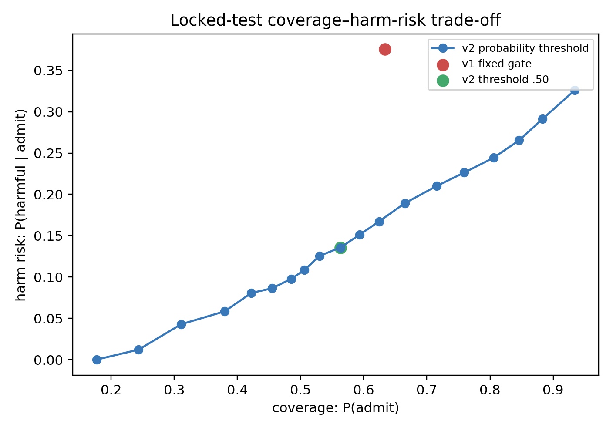
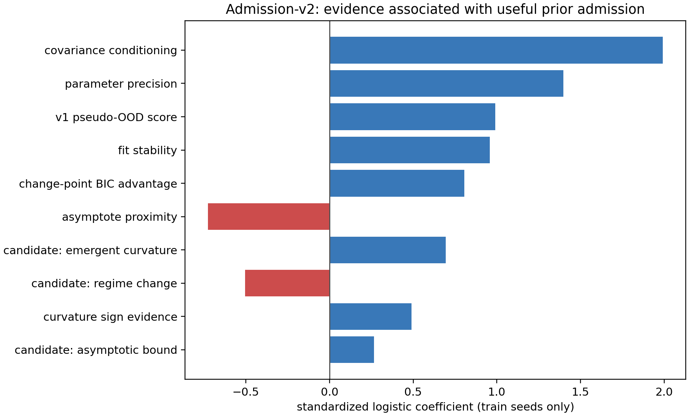
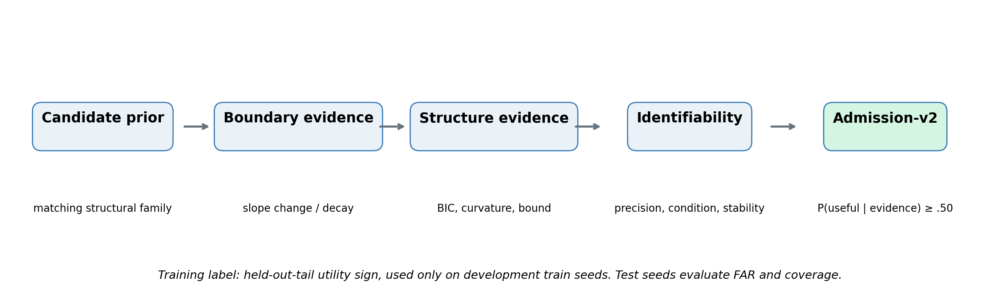

# Admission-v2 result record

## Result

Admission-v2 improves the primary locked-test safety endpoint. On 1,350 held-out
synthetic tasks, the fixed v2 `.50` threshold reduces **false admission of harmful
priors** from **65.0% (v1)** to **20.9%**, while retaining **56.3% coverage**
(v1: 63.3%). Conditional harm among admitted priors falls from **37.5%** to
**13.6%**; useful-prior admission rises from **62.4%** to **76.8%**.

This is development evidence, not confirmation: the v2 evidence vector was
motivated by the v1 failure and trained on separate synthetic development seeds.

## Design integrity

- Frozen protocol: [ADMISSION_V2_PROTOCOL.md](ADMISSION_V2_PROTOCOL.md).
- Grid: 3 generic families × 6 observability levels × 5 noise levels × 50 seeds
  = **4,500 tasks**.
- Train: seed indices 0–34. Locked test: 35–49, **1,350 tasks**.
- Test labels were not used to alter features, logistic model, or threshold.
- Label: useful iff `U = RMSE(fallback) − RMSE(matched prior) > 0`.
- `O_true` was excluded from the classifier; it remains a mechanism diagnostic.

## Locked-test comparison

| Rule | Coverage | False admission `P(admit | U<0)` | Harm among admitted `P(U<0 | admit)` | Useful-prior admit rate |
|---|---:|---:|---:|---:|
| v1 uniform pseudo-OOD | 63.3% | 65.0% | 37.5% | 62.4% |
| v2 evidence logistic, threshold .50 | 56.3% | **20.9%** | **13.6%** | **76.8%** |

By family, v2 substantially improves regime-change FAR (54.0%→14.9%) and
emergent-curvature FAR (75.9%→17.6%). Asymptotic-bound has low conditional harm
among admissions already (9.7%→7.5%), but its FAR remains high because few tasks
in that family are harmful; report both metrics together.

At more conservative test thresholds, the descriptive v2 curve moves from
coverage 80.6% / harm risk 24.4% at `.20` to 48.5% / 9.8% at `.65`, and 38.0% /
5.8% at `.80`. This is the intended coverage–risk trade-off; `.50` remains the
predeclared fixed-point result, not a selected optimum.

## What the evidence model used

The prefix-only feature vector combines boundary slope evidence, change-point
BIC and post-change support, curvature and asymptote signals, fit stability,
parameter precision, covariance conditioning, and v1 pseudo-OOD evidence.
The strongest standardized positive coefficients on train seeds were covariance
conditioning (1.99), parameter precision (1.40), v1 pseudo-OOD score (0.99),
fit stability (0.96), and change-point BIC advantage (0.81).

## Interpretation

The data support the sharpened research statement:

> A prior should be used not merely when it is correct or observable, but when
> its defining structure is observable **and identifiable enough to support a
> useful extrapolation from the available support**.

The v2 classifier predicts `P(U>0 | evidence)`, not `O_true`. This distinction
is essential: low observability is a common cause of harm, but utility—not
observability—is the admission target.

## Scope limit and next experiment

This is not yet a retrieval/RAG result and not a final admission method. Its
next valid test is a new seed/parameter-draw confirmation with the v2 model and
threshold frozen, followed by a candidate-menu experiment in which the matching
prior is not guaranteed to be present.
