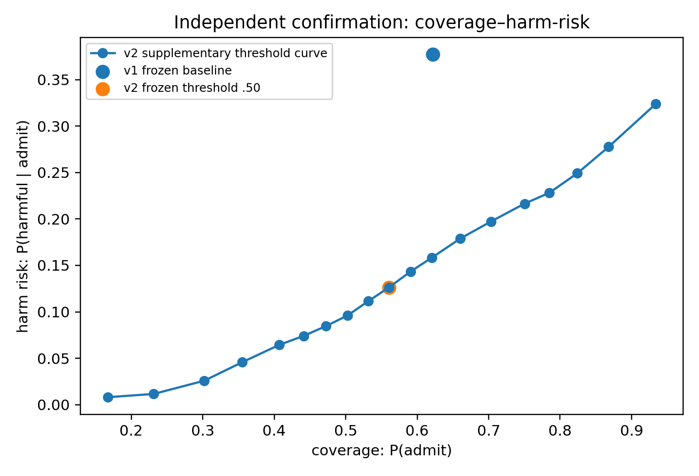

# Frozen admission-v2 confirmation — result record

## Verdict: primary confirmation passed

The immutable v2 admission rule reproduced on a fully independent 4,500-task
synthetic draw. The primary endpoint was paired false-admission difference on
harmful priors:

`Delta FAR = FAR_v2 - FAR_v1 = -0.447`, 95% paired bootstrap CI
**[-0.478, -0.417]**, `n_harmful = 1,649`.

Because the full CI is below zero, the prespecified primary confirmation
criterion passes. The runner checked the frozen v2 source hash before execution;
the rule, features, normalizer, classifier, utility label, and `.50` threshold
were not changed.

## Provenance and independence

- Frozen v2 code commit: `965868e`.
- Source/protocol/config hashes: [FROZEN_ADMISSION_V2_MANIFEST.json](FROZEN_ADMISSION_V2_MANIFEST.json).
- Development root seed: `20260920`; confirmation root seed: `20260921`.
- Both have the same 3 × 6 × 5 × 50 design, but use separate `SeedSequence`
  roots, hence no shared sampled parameters or noise realizations.
- The frozen development pipeline is exported at
  [frozen_admission_v2_pipeline.joblib](results/admission_v2_frozen_confirmation_v1/frozen_admission_v2_pipeline.joblib).

## Locked confirmation endpoints

| Rule | Coverage | FAR: `P(admit | harmful)` | Harm risk: `P(harmful | admit)` | Useful-prior admit |
|---|---:|---:|---:|---:|
| v1 uniform pseudo-OOD | 62.2% | 64.0% | 37.7% | 61.1% |
| v2 frozen admission | 56.0% | **19.3%** | **12.6%** | **77.3%** |

Thus the risk reduction is not explained by indiscriminate abstention: coverage
falls 6.1 percentage points while useful-prior admission rises 16.2 points.

## Family-level results

| Family | v1 FAR | v2 FAR | v1 useful admit | v2 useful admit | v1 coverage | v2 coverage |
|---|---:|---:|---:|---:|---:|---:|
| Regime change | 54.2% | **12.4%** | 34.6% | **52.5%** | 44.9% | 31.5% |
| Emergent curvature | 75.2% | **14.8%** | 50.4% | **67.0%** | 61.9% | 42.9% |
| Asymptotic bound | 63.2% | 69.0% | 81.9% | **96.8%** | 79.7% | 93.7% |
| Pooled | 64.0% | **19.3%** | 61.1% | **77.3%** | 62.2% | 56.0% |

The key v2 benefit reproduces where v1 was weak: regime change and emergent
curvature. Asymptotic-bound needs a different reading: harmful cases are rare,
so its FAR increases slightly while harm among admitted priors remains low
(9.0%→8.4%) and useful-prior sensitivity rises. This is why FAR, conditional
admission risk, coverage, and useful-prior sensitivity must be reported together.

## Independent phenomenon replication

The generic phenomenon also reproduces: pooled Spearman
`rho(O_true, utility) = 0.722`. Family correlations are regime change **0.571**,
emergent curvature **0.425**, and asymptotic bound **0.926**. These align with
the development observation that truth, observability, and utility are related
but distinct quantities.

## Claim boundary

The following statement is now supported **for the frozen synthetic setting**:

> Boundary, structural, and identifiability evidence can make prior admission
> substantially more selective for utility than uniform rolling pseudo-OOD
> validation, on an independent parameter/noise draw.

This does not yet establish real-data performance, a universal mechanism menu,
or retrieval/RAG quality. The next justified step is a candidate-menu experiment:
retrieve plausible prior candidates with high recall, then apply the now
confirmed admission stage for precision.
