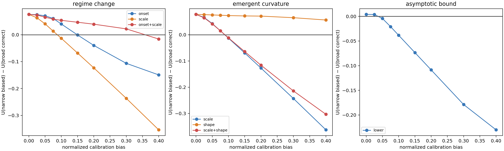

# Results — E5b Calibration Tolerance Curve v1

**Protocol:** [CALIBRATION_TOLERANCE_PROTOCOL_V1.md](CALIBRATION_TOLERANCE_PROTOCOL_V1.md)  
**Code:** `experiments/calibration_tolerance_v1.py`  
**Records:** `results/calibration_tolerance_v1/results.json`

Narrow interval width was fixed while normalized center bias swept
`0,.025,.05,.075,.10,.15,.20,.30,.40`. The outcome is
`U(narrow biased) - U(broad correct)` at D3; negative means broad correct is
safer/more useful. Noise was fixed at `.015`; each field/bias combines 150
tasks across low/mid/high observability.

| Family / realization field | First negative grid point | Harm rate vs broad there | Result |
|---|---:|---:|---|
| Bound / lower bound | .05 | 58.7% | lowest tolerance |
| Curvature / scale | .10 | 63.3% | crossover |
| Curvature / scale + shape | .10 | 60.0% | crossover |
| Curvature / shape | none through .40 | — | no tested crossover |
| Regime / onset | .15 | 60.0% | later crossover |
| Regime / scale | .10 | 62.7% | crossover |
| Regime / onset + scale | .40 | 56.7% | high tolerance in this coordinated-bias direction |

The first negative grid point is descriptive, not a continuous estimate of a
universal threshold. Nonetheless E5b closes E5's ambiguity: calibration
tolerance is not merely family-dependent, but **field-specific within family**.
Mean utility can remain near zero around a crossover while harm probability is
already high, so harm rate is a necessary companion to average utility.

