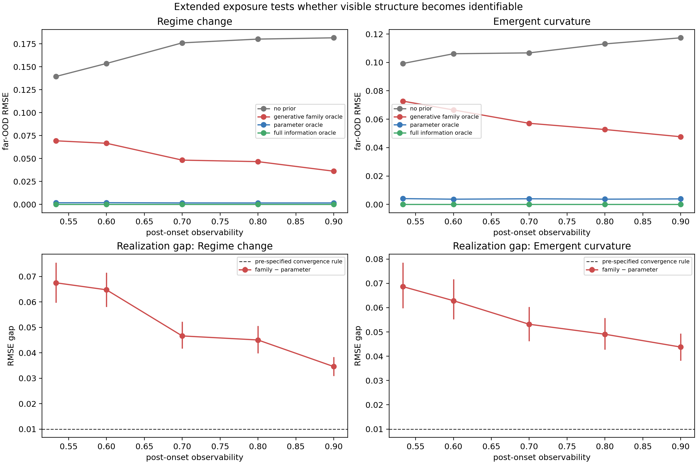
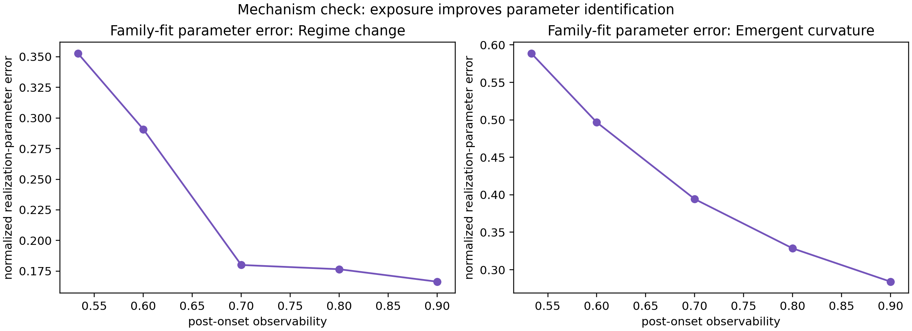

# Exposure / Identifiability Extension v1 — result record

## Answer

Within this substantially longer but still finite observed support, the
**generative-family oracle does not converge to the parameter oracle** for
either regime change or emergent curvature. The realization gap declines
monotonically with exposure, and parameter estimates become materially more
accurate, but the pre-specified convergence criterion is not met even at
`O=.90`.

This strengthens the qualified conclusion:

> **Visible structural evidence is not the same as sufficient parameter
> identifiability for safe extrapolative realization.**

It does not prove that a family label is universally intrinsically insufficient:
the result is scoped to this support length, tail distance, noise level, and
generator. It does establish that the present high-exposure grid still leaves
consequential realization uncertainty.

## Frozen design

- 2,500 new synthetic tasks: 2 families × 5 observability levels × 250 draws.
- `O = .533, .60, .70, .80, .90`; noisy prefix through `.60` (SD `.015`), clean
  far-OOD tail after `.70`.
- New random seed `20260924`; no prior development or confirmation draws reused.
- The primary endpoint is the paired realization gap
  `RMSE(generative-family oracle) − RMSE(parameter oracle)`, with 2,000 paired
  bootstrap resamples. Practical convergence was frozen as upper 95% CI `<= .01`.
- Protocol: [EXPOSURE_IDENTIFIABILITY_EXTENSION_PROTOCOL.md](EXPOSURE_IDENTIFIABILITY_EXTENSION_PROTOCOL.md).

## Primary result

| Family | O | Family-oracle RMSE | Parameter-oracle RMSE | Realization gap, 95% CI | Converged? |
|---|---:|---:|---:|---:|---|
| Regime change | .533 | .0693 | .0018 | .0675 [.0597, .0755] | No |
| Regime change | .600 | .0666 | .0018 | .0648 [.0581, .0716] | No |
| Regime change | .700 | .0483 | .0016 | .0466 [.0417, .0523] | No |
| Regime change | .800 | .0466 | .0016 | .0451 [.0398, .0506] | No |
| Regime change | .900 | .0362 | .0016 | .0346 [.0310, .0383] | No |
| Emergent curvature | .533 | .0727 | .0041 | .0687 [.0598, .0786] | No |
| Emergent curvature | .600 | .0665 | .0037 | .0629 [.0552, .0717] | No |
| Emergent curvature | .700 | .0571 | .0040 | .0532 [.0462, .0603] | No |
| Emergent curvature | .800 | .0527 | .0037 | .0491 [.0427, .0558] | No |
| Emergent curvature | .900 | .0477 | .0039 | .0438 [.0382, .0494] | No |

At `O=.90`, the family–parameter gap remains `.0346` for regime change and
`.0438` for emergent curvature—well above the pre-specified `.01` criterion.
The bootstrap intervals exclude `.01` in both cases. At the same time,
family-oracle RMSE remains substantially better than the no-prior fallback at
high O (regime `.0362` vs `.1816`; curvature `.0477` vs `.1173`). Therefore
exposure improves usefulness without eliminating the value of realization
knowledge.



## Mechanism check: parameters improve, yet remain uncertain

The normalized error of the family-fit realization parameters falls from `.353`
to `.166` for regime change and from `.589` to `.284` for emergent curvature as
O rises from `.533` to `.90`. The main residual uncertainty at high exposure is
shape/onset coupling: exponent absolute error remains `.301` (regime) and `.564`
(curvature), and onset absolute error remains `.077` and `.096`, respectively.

Thus the non-convergence is consistent with incomplete parameter
identifiability—not with failed numerical fitting (fit success is 100% for
regime and 97–100% for curvature).



## Implication for admission and retrieval

The correct admission target remains the expected utility of a **realized**
prior, `P(U_P > 0 | D_obs)`, not posterior family correctness. The evidence
chain is now:

```text
family truth → structural evidence → parameter identifiability
             → safe realization → utility
```

For a later retrieval system, candidate recall should supply not just family
labels but any scientific knowledge constraining onset, scale, shape, or bounds.
Admission then decides whether the remaining realization uncertainty is safe for
the available support.

## Status and guardrail

This is a **development** result, not a real-data claim. It rejects practical
convergence for the frozen high-exposure grid; it does not establish that no
amount of further observation can identify these parameters.

## Comparability guardrail

`O` is an exposure coordinate used **within each family**. An `O=.80` regime
change and an `O=.80` emergent-curvature trajectory need not contain the same
absolute amount or type of statistical information. The primary comparison is
therefore each family's own trajectory of parameter error and realization gap as
exposure increases—not a cross-family comparison of equal-valued `O`.
