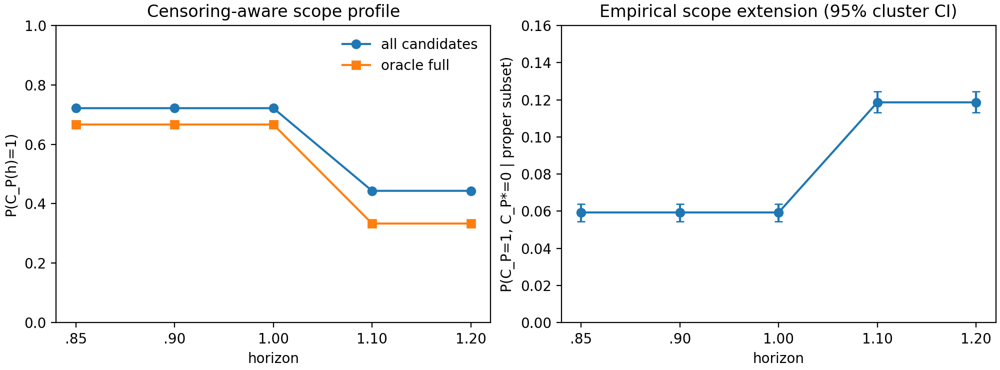
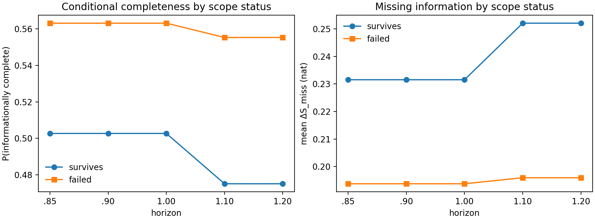

# E13 — Joint Prior Anatomy Map: Corrected Results

## Provenance and estimand

This report analyzes the corrected, read-only E13 run produced at commit
`8ea0a9c`. Its 2,160 latent tasks and 34,560 dynamic-subset candidate rows are
bound to manifest SHA-256
`a45ea724f2442ba919035ff73e65fc643ac732d48e15a550feb9d4b483579298`.
Analysis reads that frozen manifest from the producing commit rather than a
later working-tree preflight attempt. Every row conditions on core coverage
one over `Omega_0=[.40,.80]`; E13 therefore estimates joint anatomy among
valid priors, not validity as a varying predictor.

Pooled summaries use frozen within-task candidate weights and equal generator
weighting. Uncertainty is a latent-task clustered bootstrap (`B=1,000`). Scope
is summarized only through the contiguous-validity profile `P(C_P(h)=1)`;
a right-censored `H_valid*>1.20` is never converted to an endpoint number.

## Integrity and measurement support

- The corrected scorer reproduced 2,160 tasks and 34,560 rows with all
  sharpness and scope nesting invariants satisfied.
- `31,562 / 34,560` rows (`91.3%`) met `ESS>=100`.
- Candidate observability was sparse: only `117 / 34,560` rows (`0.34%`) had
  `O_P=1`; among reliable rows, the count was 109. The low-eta cells had zero
  observable reliable rows, mid eta had 31, and high eta had 78.
- All reliable rows were above the `.10 nat` informativeness threshold. Thus
  the **binary** informativeness label is saturated in this frozen corpus.

The last two facts are measurement-support limits, not failed integrity gates.
They mean that the `O_P` association panel is descriptive-only and that a
binary informativeness-versus-scope relation cannot be estimated here. The
continuous sharpness summaries are retained descriptively but are not causal
claims.

The predeclared `informative-but-unobservable` state occurred in 31,453 rows.
Because every reliable row is binary-informative in this corpus, this occupancy
is numerically identical to `reliable & O_P=0`. It is evidence that the two
measurements can be operationally separated on the same task, **not** evidence
for a general empirical relation between informativeness and observability.

## 1. Completeness is marginal and conditional

Among 29,580 reliable atom-incomplete rows, all had an exact missing-information
gap and 16,125 were informationally complete, for a rate of **54.5%**. This is
not merely a logical-implication artifact. Restricting to the 13,609 reliable,
incomplete candidates with **no logically implied omitted atom**, 59.9% were
informationally complete (`Delta S_miss<=.10 nat`; latent-task clustered 95% CI
58.7–61.2%; 1,982 latent tasks).

> **Completeness is marginal and conditional, not merely syntactic.**

> **Grammar-relative incompleteness does not necessarily imply conditional
> information loss. Even when no omitted atom was logically implied by the
> retained prior, 59.9% of reliable incomplete candidates remained
> informationally complete (`Delta S_miss<=.10`; clustered 95% CI 58.7–61.2%).**

The operational interpretation is deliberately limited: **given the observed
prefix and the retained prior content, the omitted atom contributes little
additional restriction to the continuation set.** E13 does not separate a
prefix-only mechanism from a retained-constraints-only mechanism.

The mutually exclusive omission classes make the distinction visible:

| Omission class | Rows | Latent tasks | Median `Delta S_miss` | Informationally complete |
|---|---:|---:|---:|---:|
| all implied | 2,211 | 1,717 | .003 | 80.1% |
| no implied | 13,609 | 1,982 | .040 | 59.9% |
| mixed | 13,760 | 1,717 | .134 | 45.1% |

`all implied` documents logical redundancy. The non-implied result documents
conditional redundancy beyond explicit grammar implication. The lower mixed
rate is descriptive only: omitted-atom count and realized-envelope size differ
across classes, so it is not an intrinsic "mixed omission" effect without a
standardized follow-up.

## 2. Censoring-aware scope profile

The full-envelope scope strata were quota-balanced by construction; their
one-third/full survival profile is therefore provenance, not a claim about a
natural prevalence of short scope. The empirical quantity is the *magnitude*
of subset scope extension, not its direction (which is guaranteed by AND
nesting).

| Horizon | All candidates `P(C_P=1)` | Oracle-full `P(C_P=1)` | Among proper-subset candidate rows: `C_P=1` and `C_P*=0` |
|---|---:|---:|---:|
| .85 / .90 / 1.00 | 72.2% | 66.7% | 5.9% (95% CI 5.5–6.4%) |
| 1.10 / 1.20 | 44.3% | 33.3% | 11.9% (95% CI 11.3–12.4%) |

Thus, within this frozen post-`.80` intervention family, omitting some true
atoms sometimes extends the continuously valid scope materially. This does
not establish a general causal relation between prior completeness and scope:
scope was controlled and the full prior's stratum was balanced.

## 3. Scope–completeness map: descriptive only

For reliable incomplete candidates with exact gaps, informational completeness
was 50.3% among candidates surviving through `.85–1.00` versus 56.3% among
those already failed at those horizons. At `1.10–1.20`, the corresponding
rates were 47.5% and 55.5%. Mean `Delta S_miss` showed the complementary
pattern (`.232` versus `.194` early; `.252` versus `.196` late).

These are censored-aware, task-clustered descriptive profiles. They should not
be read as an effect of persistence: omitted-atom identity, envelope size, and
the controlled scope intervention may all differ between the two groups. Their
direction is therefore not emphasized as an E13 finding.

## 4. Dependency-masked association map

The following relations are not presented as discoveries: core validity with
any axis (all rows are core-valid), candidate size with `C_atom`, `S` with
`Delta S_miss`, `N_obs` with `O_P`, and the subset-versus-full scope direction.
The surviving descriptive panels are `S <-> C_P(h)` and exact-gap
`Delta S_miss <-> C_P(h)`. The `O_P <-> C_P(h)` panel is reported only as a
support audit because observability is nearly degenerate.

In this corpus, all reliable candidates are binary-informative. Conditional
scope survival among those rows is therefore simply 72.3% through `.85–1.00`
and 44.2% through `.1.20` (clustered 95% CIs 70.6–74.1% and 42.6–46.0%).
The thresholded label cannot distinguish an informativeness–scope association;
no association direction is claimed.

## Frozen E13 conclusions

> **Completeness is marginal and conditional, not merely syntactic.**

> **Informativeness can exist without current observability, but E13's
> observability support is too sparse to estimate a general observability
> association.**

> **Conditionally informative priors can nevertheless have limited validity
> scope; scope therefore remains a separate, censoring-aware prior property.**

## Boundary

E13 maps the joint anatomy of valid priors in this frozen one-dimensional
canonical grammar, paired continuation bank, evidence construction, and
post-`.80` intervention family. It does not estimate real-world prevalence,
primitive-intrinsic rankings, prediction utility, safety, causal effects of
scope, or an LLM's ability to select priors. E12-A/B remain separate evidence
about numerical and structural misspecification after validity fails.

## Reproducible artifacts

- [Corrected full rows](results/joint_prior_anatomy_e13/corrected_run/run/rows.csv)
- [Corrected run integrity summary](results/joint_prior_anatomy_e13/corrected_run/run/summary.json)
- [Completeness analysis](results/joint_prior_anatomy_e13/corrected_analysis/completeness_by_implied_status.csv)
- [Censoring-aware scope profile](results/joint_prior_anatomy_e13/corrected_analysis_scope/censored_scope_profile.csv)
- [Scope–completeness profile](results/joint_prior_anatomy_e13/corrected_analysis_scope/completeness_scope_profile.csv)
- [Dependency mask](results/joint_prior_anatomy_e13/corrected_analysis_scope/dependency_mask.csv)
- [Scope/association analysis script](experiments/analyze_e13_scope_association.py)
