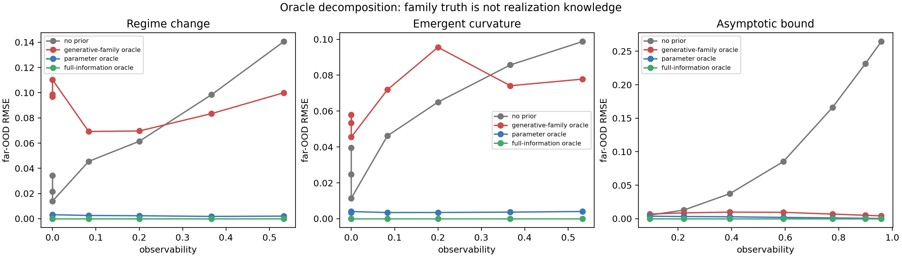
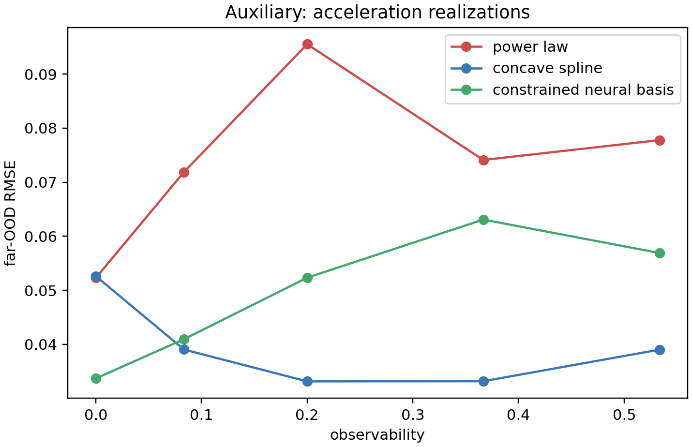

# Oracle Decomposition v1 — result record

## Answer to the core question

Knowing the correct structural family does **not** identify the realization
needed for extrapolation. In this experiment, the generative-family oracle knows
the right family but fits all consequential parameters from the noisy prefix;
the parameter oracle receives the key realization parameters; the full-information
oracle receives every generator parameter.

The observed low-observability pattern is direct evidence for:

> **Structural truth is not knowledge of its extrapolative realization.**

## Design

- 2,100 independent tasks: 3 generic families × 7 observability levels × 100 draws.
- Prefix: noisy `t <= .60`, SD `.015`; endpoint: clean `t > .70`.
- Parameter-oracle information: regime change and curvature receive true onset,
  post-onset scale, and exponent; asymptotic bound receives true lower limit.
- Full-information oracle predicts with all true generator parameters and is a
  zero-error reference by construction.
- Protocol: [ORACLE_DECOMPOSITION_PROTOCOL.md](ORACLE_DECOMPOSITION_PROTOCOL.md).

## Main decomposition result

| Family / observability | No prior RMSE | Generative-family oracle | Parameter oracle | Full-information oracle |
|---|---:|---:|---:|---:|
| Regime change, O=0 | 0.014–0.034 | **0.097–0.110** | **0.003** | 0.000 |
| Regime change, O=.533 | 0.141 | 0.100 | **0.002** | 0.000 |
| Emergent curvature, O=0 | 0.011–0.040 | **0.046–0.058** | **0.003–0.004** | 0.000 |
| Emergent curvature, O=.533 | 0.099 | 0.078 | **0.004** | 0.000 |
| Asymptotic bound, O=.095 | **0.005** | 0.007 | **0.004** | 0.000 |
| Asymptotic bound, O=.959 | 0.264 | 0.004 | **0.0003** | 0.000 |

At low O, a matching family label can be far worse than a linear fallback while
parameter information nearly recovers the full-information bound. This rules out
the explanation “the family was wrong”: the family is true in all conditions.
The missing information is the realization geometry that the prefix cannot
reliably determine.



## Important qualification: the gap does not fully close yet

Family-oracle RMSE improves relative to fallback as O increases for regime change
and curvature, but it does **not** converge fully to the parameter-oracle curve
within the tested support (maximum O=.533). That is a useful negative finding:
visible evidence and enough evidence for parameter identification are not the
same threshold. A later experiment should extend support/exposure before claiming
family-oracle convergence.

Thus the supported chain is:

```text
family truth → structural evidence → parameter identifiability → safe realization → utility
```

not the weaker claim that family truth or mere visibility is sufficient.

## Acceleration realization robustness (auxiliary)

The same acceleration/concavity prior was realized as a power law, a
concavity-constrained piecewise-linear spline, and a shallow constrained
ReLU-squared neural basis. At O=0, all three have far-OOD RMSE 0.034–0.053,
above the corresponding linear-fallback range 0.011–0.040. At O=.533, all three
are below the fallback RMSE 0.099 (power law .078, spline .039, neural basis
.057). Therefore low-observability harm is not confined to the power-law fit.



## Consequence for admission-v2

Admission-v2 should be described as deciding whether a **generative-family
oracle can be safely realized from available support**, not whether the prior is
true. The full-information oracle should always be used; rejecting a matching
family prior is justified only when its unobserved realization parameters remain
insufficiently identified.
