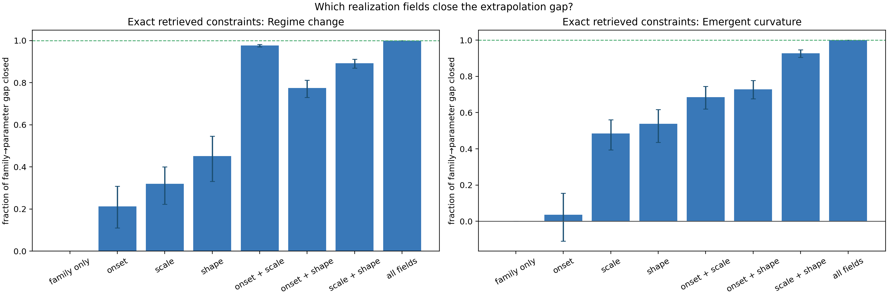
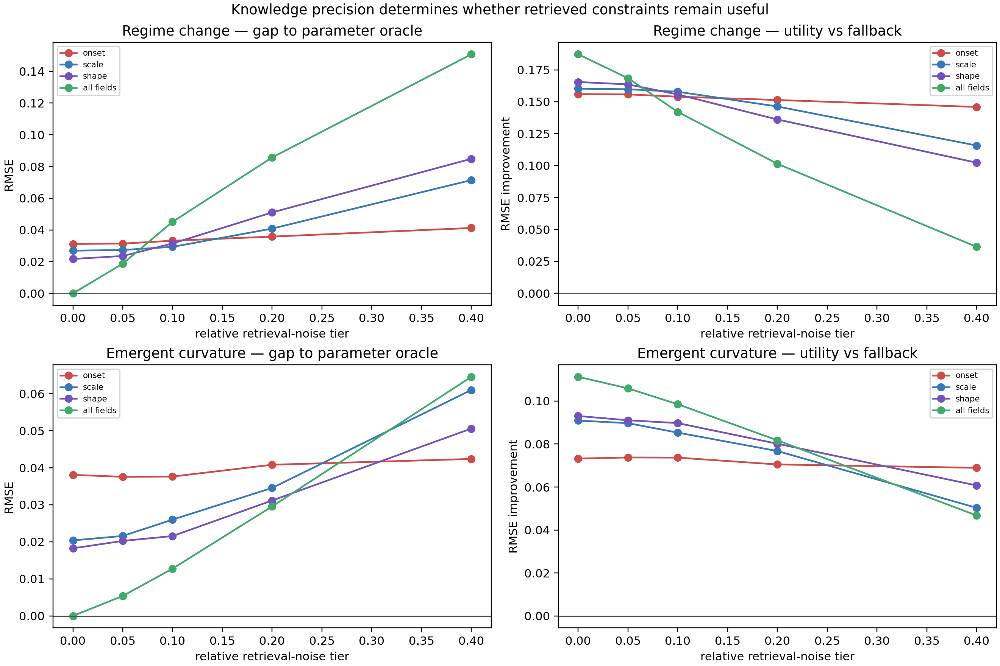

# Partial Realization Knowledge Sweep v1 — result record

## Answer

The useful content of external knowledge is **family-dependent**. At high
exposure (`O=.90`), a family label is already useful but does not close the
family-to-parameter gap. Exact constraints on the right *combination* of
realization fields close most of that gap:

- **Regime change:** onset+scale closes **97.7%** of the gap; scale+shape closes
  **89.2%**; onset+shape closes **77.5%**.
- **Emergent curvature:** scale+shape closes **92.8%**; onset+shape closes
  **72.9%**; onset+scale closes **68.6%**.

Onset alone is not the main universal bottleneck: it closes only 21.3% for
regime change and 3.6% for curvature. A later retrieval system must retrieve
family-conditioned realization constraints—not merely a structural label and
not one universal “onset” field.

## Frozen design

- 400 independent base trajectories: 2 families × 200 paired noisy prefixes,
  all at `O=.90`; each prefix is reused across every knowledge condition.
- 14,400 fitted condition evaluations: family-only plus 7 nonempty field subsets
  at 5 retrieval-precision tiers.
- Consequential fields: onset `τ`, scale `k2`, and shape/exponent `α`; initial
  rate is always fit from the prefix.
- Prefix `t<=.60`, Gaussian noise SD `.015`; clean tail `t>.70` is evaluation
  only. New generator seed `20260926`.
- Protocol: [PARTIAL_REALIZATION_KNOWLEDGE_PROTOCOL.md](PARTIAL_REALIZATION_KNOWLEDGE_PROTOCOL.md).

## Exact constraint ablation

`Gap closure` is the fraction of the mean family-only → parameter-oracle RMSE
gap removed by a condition. Intervals are paired bootstrap 95% intervals.

| Family | Exact retrieved fields | Partial RMSE | Gap closure (95% CI) |
|---|---|---:|---:|
| Regime change | onset | .0328 | 21.3% [11.1, 30.8] |
| Regime change | scale | .0285 | 32.0% [22.3, 40.0] |
| Regime change | shape | .0233 | 45.2% [33.1, 54.7] |
| Regime change | onset+scale | .0025 | **97.7% [97.0, 98.2]** |
| Regime change | onset+shape | .0105 | 77.5% [73.0, 81.3] |
| Regime change | scale+shape | .0059 | 89.2% [86.9, 91.2] |
| Emergent curvature | onset | .0417 | 3.6% [-10.9, 15.5] |
| Emergent curvature | scale | .0240 | 48.4% [39.4, 56.1] |
| Emergent curvature | shape | .0218 | 53.8% [43.6, 61.7] |
| Emergent curvature | onset+scale | .0160 | 68.6% [62.0, 74.5] |
| Emergent curvature | onset+shape | .0143 | 72.9% [67.6, 77.7] |
| Emergent curvature | scale+shape | .0065 | **92.8% [90.5, 94.7]** |



## Retrieval precision changes deployment value

Exact all-field knowledge is the parameter-oracle reference, but its advantage
is sensitive to retrieval noise because all fields are fixed rather than
corrected by prefix fitting.

- For regime change, all-field closure falls from 100% (exact) to 53% at tier
  `.05`, then below family-only at tier `.10` (−14%).
- For curvature, all-field closure remains 86% at `.05`, 68% at `.10`, and 25%
  at `.20`; it falls below family-only at `.40` (−63%).
- Single-field constraints are often more robust but cannot approach the
  parameter reference alone. For example, curvature shape alone closes 45% at
  `.10` and 21% at `.20`; regime onset alone remains modestly useful through
  `.20` but never closes more than 21%.

This is the practical reason to represent retrieval output as uncertain
constraints. Supplying several inaccurate point values can be worse than
providing a smaller, reliable subset and letting the prefix fit the rest.



## What this establishes

```text
Knowledge type × knowledge precision → far-OOD utility.
```

The required ontology is supported by evidence rather than preference:

```text
structural family
└── realization constraints
    ├── onset
    ├── scale
    ├── shape
    └── uncertainty / confidence / provenance
```

The field ranking differs by family, so both retrieval targets and admission
should be prior-conditioned: `A(P, D_obs)`, where `P` includes a family plus
its uncertain realization constraints.

## Scope and next decision

This is a synthetic development study at one high-exposure point, not a RAG
evaluation or a universal field-importance ranking. The next step is to freeze
a **RAG information specification** from these results: retrieve evidence for
scale+onset for regime change and scale+shape for curvature, together with an
explicit uncertainty representation. Only then should actual retrieval be
evaluated; otherwise retrieval recall, omitted fields, inaccurate constraints,
and admission errors remain confounded.
