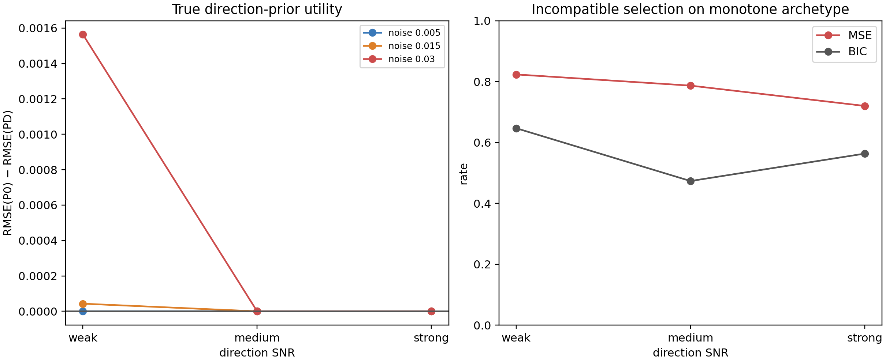

# Results — Prior Archetype Generalization v1

**Protocol:** [PRIOR_ARCHETYPE_GENERALIZATION_PROTOCOL_V1.md](PRIOR_ARCHETYPE_GENERALIZATION_PROTOCOL_V1.md)  
**Code:** `experiments/prior_archetype_generalization_v1.py`  
**Records:** `results/prior_archetype_generalization_v1/results.json`

## Result

The random-monotone archetype confirms an important distinction: a true,
simple direction constraint does not itself provide a better point forecast
than an unconstrained affine continuation when the fitted affine slope is
already decreasing. Direction-prior utility is essentially zero at medium and
strong SNR. At weak SNR and noise `.030`, direction constraining helps modestly:
`RMSE(P0)-RMSE(PD)=.00156 [.00065,.00272]`.

Nevertheless, MSE selection frequently chooses structurally incompatible
curvature/bound/transition candidates. At D3 its incompatible-selection rate is
82.3% / 78.7% / 72.0% for weak / medium / strong SNR. Predictive BIC lowers
these to 64.7% / 47.3% / 56.3%, and also lowers D3 regret in every SNR group:

| Direction SNR | MSE D3 regret | BIC D3 regret |
|---|---:|---:|
| Weak | .1407 | .0190 |
| Medium | .1715 | .0484 |
| Strong | .1388 | .0972 |

## Interpretation

This is not evidence that monotonic direction gives sufficient extrapolative
realization information. It does not: the random continuation magnitude and
curvature are intentionally not shared. But it does show that MSE can reward a
spurious specific realization even when the only true common prior is simple
direction. Complexity-aware BIC improves selection without claiming to recover
the full continuation.

