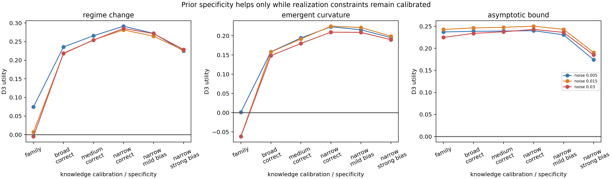

# Results — E5 Prior Calibration × Specificity v1

**Status:** development result; interval rules frozen before execution  
**Protocol:** [PRIOR_CALIBRATION_SPECIFICITY_PROTOCOL_V1.md](PRIOR_CALIBRATION_SPECIFICITY_PROTOCOL_V1.md)  
**Code:** `experiments/prior_calibration_specificity_v1.py`  
**Records:** `results/prior_calibration_specificity_v1/results.json`

## Design

Three families × low/mid/high evidence × three noise levels × 100 draws =
2,700 base trajectories. Correct family is held fixed; only realization
constraint width and center calibration change. Primary outcome is D3 utility,
`RMSE(affine fallback) - RMSE(prior)`.

## Pooled result

| Knowledge condition | Mean utility (95% CI) | Harmful prior rate |
|---|---:|---:|
| Family only | .0732 [.0626, .0843] | 23.0% |
| Broad correct | .2061 [.2000, .2123] | 3.1% |
| Medium correct | .2293 [.2233, .2355] | 1.4% |
| Narrow correct | **.2498 [.2442, .2557]** | **1.0%** |
| Narrow, mild bias | .2404 [.2346, .2463] | 1.0% |
| Narrow, strong bias | .2015 [.1961, .2066] | 4.7% |

Correct constraints show the expected specificity ordering: narrow > medium >
broad > family-only. Strongly biased narrow constraints lose most of that gain;
pooled broad-correct slightly exceeds narrow-strong-bias (`.2061 > .2015`).

## Crossover qualification

The crossover is **family-dependent**, not universal in v1. Averaged within
family, broad-correct versus narrow-strong-bias utility is:

| Family | Broad correct | Narrow strongly biased | Interpretation |
|---|---:|---:|---|
| Asymptotic bound | .2396 | .1833 | clear broad-over-biased-narrow reversal |
| Emergent curvature | .1547 | .1945 | narrow still better at tested bias |
| Regime change | .2240 | .2266 | near tie at tested bias |

Thus the supported claim is not a single universal calibration threshold `e*`.
Instead, the calibration tolerance of specificity is prior-family dependent.
The bound family has a visible reversal at the predeclared strong-bias setting;
regime and curvature require an error-density extension to locate or rule out a
later crossover.

## Interpretation

E3's result was not “strong priors are safe at low observability.” More
precisely: **strong realization constraints are powerful when calibrated.** E5
shows that their gain degrades as calibration error grows, but the rate depends
on which realization field and family are constrained. This preserves the three
separate dimensions:

```text
truth of structural family
calibration of realization constraint
incremental information beyond the baseline
```

Admission-v2 is intentionally not reported here: its frozen confirmation-time
classifier artifact (preprocessing and learned coefficients) has not yet been
exported. Re-training it on E5 would invalidate a miscalibration generalization
claim.


