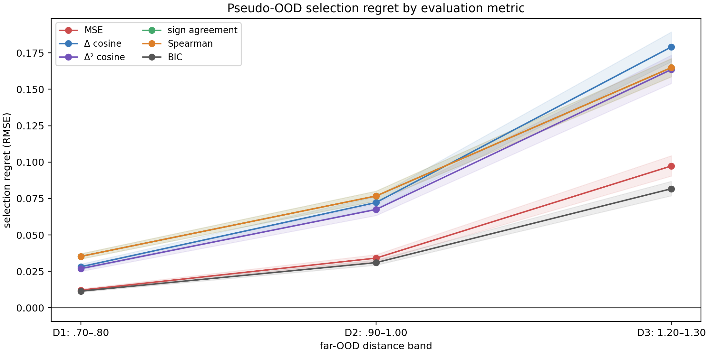
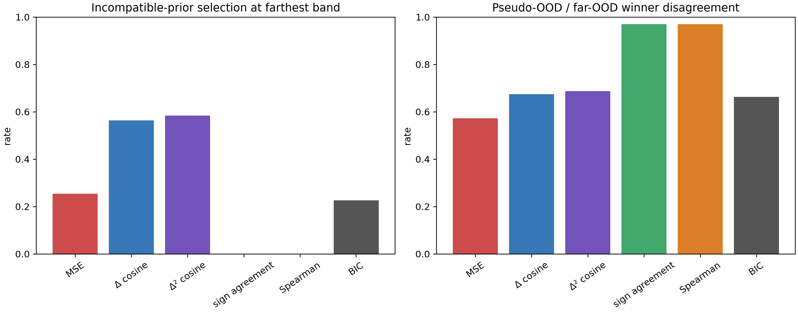

# Results — Prior Evaluation Metric Experiment v1

**Status:** development result; protocol frozen before execution  
**Protocol:** [PRIOR_EVALUATION_METRIC_PROTOCOL_V1.md](PRIOR_EVALUATION_METRIC_PROTOCOL_V1.md)  
**Code:** `experiments/prior_evaluation_metric_v1.py`  
**Machine-readable records:** `results/prior_evaluation_metric_v1/results.json`  
**Design:** 3 generators × 3 observability settings × 3 noise levels × 100 draws
= **2,700 trajectories**. Candidate selection uses only `.45 < t <= .60`; the
chosen candidate is refit on `t <= .60` and assessed at D1 `.70–.80`, D2
`.90–1.00`, and D3 `1.20–1.30`.

## Question

Does pseudo-OOD pointwise MSE select structural-prior candidates as well as
trajectory/derivative/complexity metrics when the true evaluation lies farther
outside observed support?

## Primary result: MSE is competitive, but predictive BIC is better pooled

| Selection metric | D1 regret (95% CI) | D2 regret (95% CI) | D3 regret (95% CI) | incompatible selection |
|---|---:|---:|---:|---:|
| Pseudo-OOD MSE | .0121 [.0113, .0130] | .0341 [.0318, .0365] | .0973 [.0905, .1044] | 25.4% |
| Predictive BIC | **.0114 [.0108, .0121]** | **.0310 [.0292, .0328]** | **.0817 [.0769, .0869]** | **22.7%** |
| First-difference cosine | .0282 | .0723 | .1790 | 56.4% |
| Second-difference cosine | .0269 | .0675 | .1635 | 58.4% |
| Derivative-sign agreement | .0353 | .0767 | .1648 | 0.0% |
| Spearman trend | .0353 | .0767 | .1648 | 0.0% |

At the farthest band, predictive BIC reduces pooled regret by **16.1%** versus
MSE (`.0973 → .0817`) and reduces incompatible selections by **2.8 percentage
points**. The result is a complexity-aware *predictive* criterion, not evidence
that a derivative metric alone is sufficient.

## What did not work

Derivative-sign agreement and Spearman never select a structurally incompatible
candidate in this candidate library, but they have very high pseudo-vs-far
winner disagreement (97.0% at D3) and much higher regret. They are too coarse:
they preserve direction but discard realization information needed to choose
among directionally compatible continuations. First- and second-difference
cosines are also worse than MSE and choose incompatible candidates frequently.

Therefore the supported statement is deliberately narrower than the proposed
hypothesis:

> Pointwise pseudo-OOD MSE is not uniformly optimal for structural-prior
> selection; a complexity-aware predictive criterion improved pooled far-OOD
> selection in this fixed candidate library. Derivative/trend metrics alone did
> not improve it.

## Family qualification

The pooled BIC gain is not uniform. It is strongest for asymptotic-bound
settings, particularly at low/mid evidence and larger noise. In several
high-exposure regime-change cells, MSE has lower regret. Thus this is **not** a
claim that BIC universally dominates MSE, nor that one universal selection
metric should ignore the prior family.

## Figures

## Consequence for E2

The protocol's prespecified handoff criterion was met: at D3, the non-pointwise
BIC selector has lower pooled regret and no higher incompatible-selection rate
than MSE. E2 will therefore compare **MSE versus predictive BIC** under matched
and deliberately mismatched residual capacity. The central E2 question is not
whether BIC is universally best, but whether MSE's near-support advantage can
be driven by flexible residual realization rather than structural validity.
