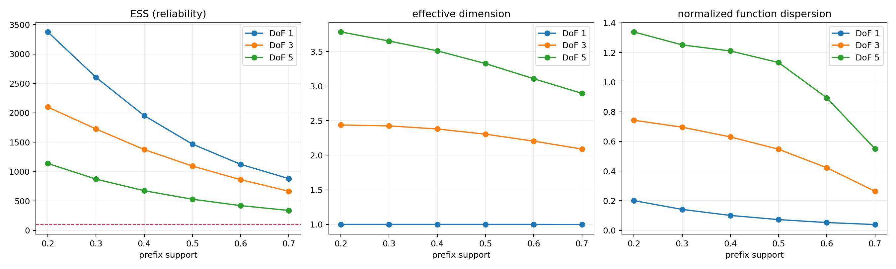
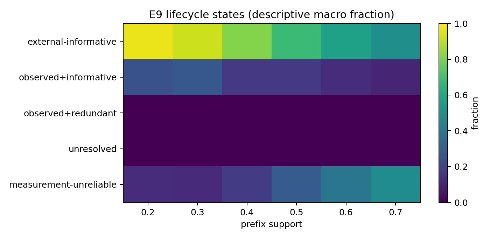

# E9 — Prior Information Lifecycle: frozen full run

## Scope

E9 measures the information lifecycle of a **supplied valid structural prior**
under nested prefix evidence. It does not evaluate prediction utility, engine
compatibility, safety, scope, completeness, or fragility. The entire result is
limited to the frozen 1D progression-to-scalar grammar.

Protocol: [minimum informational evidence](PRIOR_MINIMUM_INFORMATIONAL_EVIDENCE_PROTOCOL_V1.md) ·
[execution freeze](E9_EXECUTION_FREEZE_V1.md) ·
[numeric configuration](E9_FROZEN_CONFIG_V1.json).

## 1. Integrity — passed

| Check | Result |
|---|---:|
| Independent latent tasks | 1,260 / 1,260 |
| Repeated scoring rows | 22,680 / 22,680 |
| Runtime failures | 0 |
| Full invariant strata | 63 / 63 passed |
| Future-free scoring API | passed |

The integrity suite verified nested observations, one shared noise realization,
a byte-identical ambient bank over all prefixes/DoF levels, zero inactive
coordinates, fixed `G=[.70,1]`, coverage invariance, finite measures, and toy
endpoint/censoring logic. It did not gate on any expected direction or
monotonicity of sharpness, ESS, effective dimension, or dispersion.

## 2. Measurement reliability

| Metric | Value |
|---|---:|
| ESS median | 765.5 |
| ESS 5th–95th percentile | 3.5–3,891.3 |
| Final-prefix sampler-unresolved rate | 48.4% |
| `d_eff` median | 2.22 |
| normalized `V_f` median | 0.173 |

The large low-ESS tail is a measurement limitation, not a lifecycle state.
Previously attained endpoints remain valid if `.70` later becomes
sampler-unresolved; endpoint conclusions that require a final reliable prefix
are correspondingly restricted.

## 3. Lifecycle endpoints

| Endpoint | Attained rate | Median among attained |
|---|---:|---:|
| `E_add*` | 99.3% | .20 |
| `E_obs*` | 9.6% | .40 |
| `E_joint*` | 8.3% | .40 |
| confirmed `E_red*` | 0.0% | — |
| informational null at `.70` | 0.0% | — |
| joint-unresolved at `.70` | 48.6% | — |

`E_add*` is a grid-resolved first reliable sharpness onset, not an exact
continuous minimum. First attainment at `.20` is left-censored; never attained
by `.70` is right-censored. `E_red*` is only at risk after `E_joint*` and needs
two consecutive redundant prefixes; none was confirmed in this run.

The endpoint pattern should **not** be read as a universal statement that
external priors are informative at 20% support. It is a property of this frozen
ambient-bank and structural-evidence measurement setup. The high
sampler-unresolved rate and sparse structural-observation endpoint are retained
as first-order results, not removed post hoc.

## 4. Lifecycle states

Across reliable prefix measurements, external-informative states dominated:
direction 89.0%, curvature 84.8%, bound 85.5%, regime 82.7%; asymptote was
more mixed (57.2% external-informative, 16.9% observed+informative). The
measurement-unreliable fraction ranged from 8.0% (direction) to 46.0%
(inflection). Bound and inflection had no observed+informative measurements
under the frozen `E_struct >= .80` definition.

This is descriptive anatomy of the measurement states. It is not a primitive
quality ranking and does not establish utility or trust.

## 5. Difficulty anatomy

The predeclared `eta` control produced no observed endpoints at low eta and
more observations at mid/high eta (0 / 138 / 225 `E_obs*` attainments across
the 1,260 task–DoF trajectories). This is consistent with eta being a
generator-level separability control; it must not be interpreted as an
equal-difficulty scale across primitives. DoF effects remain descriptive because
`d_eff` and normalized dispersion are observed consequences, not sanity gates.

## Figures

## Stored artifacts

- `results/prior_information_lifecycle_e9/sanity/summary.json`
- `results/prior_information_lifecycle_e9/run/scoring_rows.csv`
- `results/prior_information_lifecycle_e9/run/endpoint_rows.csv`
- `results/prior_information_lifecycle_e9/analysis/attainment_*.csv`
- `results/prior_information_lifecycle_e9/analysis/bootstrap_E_add_5000.csv`
- `results/prior_information_lifecycle_e9/analysis/bootstrap_E_joint_5000.csv`
- `results/prior_information_lifecycle_e9/analysis/difficulty_anatomy.csv`

## Conclusion

The frozen E9 apparatus ran without integrity failures and separates
prior-added information, prefix structural observation, joint information, and
redundancy as intended. In this run, reliable additional-information onset was
common, while structurally observed and jointly informative states were much
rarer and confirmed redundancy did not occur. Because reliability limits are
substantial and E9 excludes utility by design, the appropriate next inference
is only that information lifecycle state must be reported with measurement
reliability—not that any prior has become safe, useful, complete, or globally
trustworthy.
