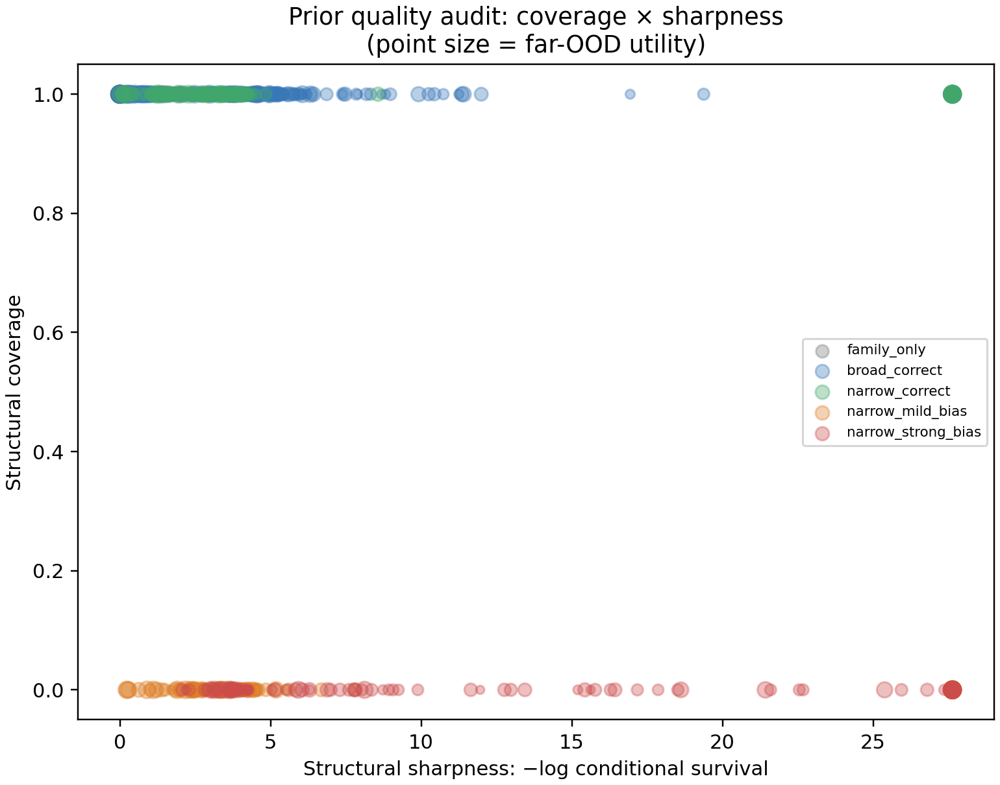

# Results — Prior Quality Audit v1

**Purpose.** Define structural-prior quality independently of prediction RMSE:
does a prior preserve the true continuation (coverage), and how much does it
restrict prefix-consistent continuation space (sharpness)?

**Method.** For 810 E5-style tasks, sample 600 family-parameter continuations
from the parameter box and weight them by observed-prefix likelihood. For each
knowledge condition, coverage is whether true realization parameters remain in
the supplied constraint; sharpness is `-log` of the weighted surviving mass.
This is a synthetic, family-parameter approximation to continuation-space
restriction, not an exact function-space volume.

| Condition | Mean coverage | Mean sharpness | Interpretation |
|---|---:|---:|---|
| Family only | 1.00 | 0.00 | true but unrestrictive |
| Broad correct | 1.00 | 7.52 | safe, moderately informative |
| Narrow correct | 1.00 | 24.64 | ideal in this audit: true and sharp |
| Narrow mild bias | 0.00 | 25.07 | confidently wrong |
| Narrow strong bias | 0.00 | 25.93 | confidently wrong |

**Conclusion.** Coverage and sharpness are distinct axes. A narrow biased
constraint can be as sharp as a narrow correct one while excluding the true
realization entirely. This gives a structural explanation for E5/E5b: utility
cannot be inferred from specificity alone.

**Limit.** Incremental information equals sharpness relative to family-only in
this v1 audit, because the reference ensemble is already conditioned on the
prefix and family. A later audit should use a wider cross-family/nonparametric
continuation ensemble to quantify incremental information beyond a baseline
predictor.

