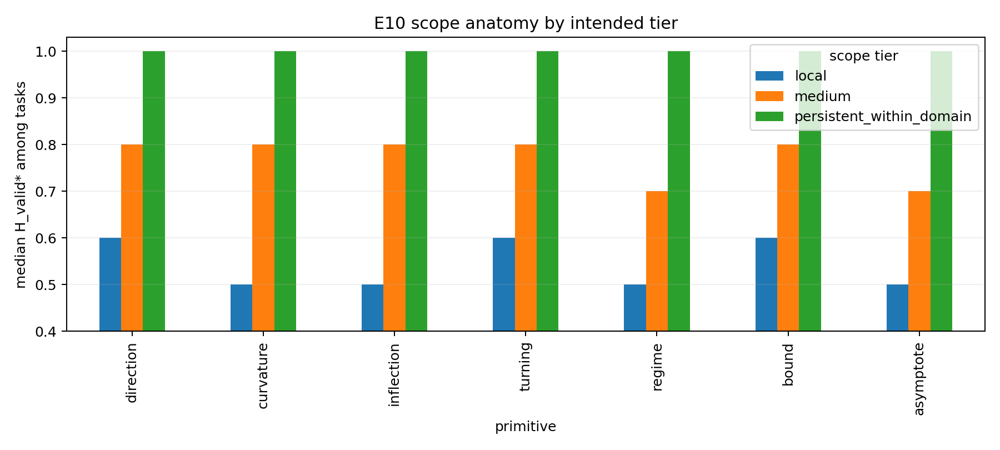

# E10 — Prior Scope / Validity Horizon

## Integrity

The frozen clean-oracle corpus completed with **1,890 latent tasks** and
**13,230 scope rows** (seven horizons per task), zero runtime failures, and
all integrity checks passed. Each task was valid on the first tested interval
`[.40,.45]`; event primitives had their primary event before `.40`; scope was
computed with the contiguous first-failure process, not the last raw-valid
point.

## Measurement

For every horizon, raw validity is `V_P(h)`. The reported endpoint is based on
`C_P(h_j)=product_{k<=j}V_P(h_k)`: after the first raw scope failure, the
contiguous horizon cannot recover even if a later percentage checker
re-passes. A trajectory valid through `1.00` is called
**persistent-within-tested-domain**, not globally persistent.

E10 uses clean latent trajectories solely as an oracle scope label. It uses no
observation noise, conditional sharpness, prediction engine, RMSE, utility, or
safety target.

## Outputs

Stored tables: `results/prior_scope_validity_horizon_e10/analysis/` contains
contiguous/raw survival, `H_valid*` summaries, terminal persistence, and an
integrity summary. The protocol and numeric checker/splice table are in
[E10 protocol](PRIOR_SCOPE_VALIDITY_HORIZON_PROTOCOL_DRAFT_V1.md) and
[frozen configuration](E10_FROZEN_CONFIG_V1.json).

## Observed scope values

The table reports median `H_valid*` over 90 tasks per primitive × induced scope
tier (30 seeds × 3 generators). The persistent-within-domain endpoint rate was
100% for every primitive in its deliberately persistent tier and 0% in local
and medium tiers; pooled terminal persistence is therefore 33.3% by design.

| Primitive | Local median | Medium median | Persistent-within-domain median |
|---|---:|---:|---:|
| Direction | .60 | .80 | 1.00 |
| Curvature | .50 | .80 | 1.00 |
| Inflection | .50 | .80 | 1.00 |
| Turning | .60 | .80 | 1.00 |
| Regime* | .50 | .70 | 1.00 |
| Bound | .60 | .80 | 1.00 |
| Asymptote* | .50 | .70 | 1.00 |

`*` Regime and asymptote use the declared latent-assisted mechanism/scope
labels and are not interchangeable with phenomenological derivative checks.

Across matched primitive × tier × seed triples, spline/basis/ODE agreed on the
coarse scope class (local: `H_valid*<=.60`; medium: `.60<H_valid*<1`; terminal
persistent: `H_valid*=1`) for 100% of trajectories. This supports generator
robustness of the **controlled scope-label recovery**, not a claim that real
scientific priors have identical persistence across data-generating families.

The local and medium tiers were intentionally injected into the generators.
Consequently, these values validate that the E10 apparatus distinguishes scope
classes; they are not evidence that direction is intrinsically more persistent
than curvature, bound, or any other primitive in the real world.

## Interpretation boundary

E10 distinguishes a highly local constraint from one that persists through the
tested domain. It does not determine whether either constraint is informative,
complete, calibrated, useful, safe to deploy, or compatible with a realization
engine. Those remain separate questions from E9, E11, E12, and later work.
