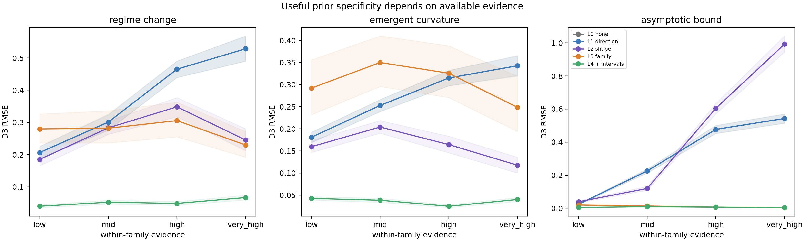

# Results — Prior Specificity Hierarchy v1

**Status:** development result; protocol frozen before execution  
**Protocol:** [PRIOR_SPECIFICITY_HIERARCHY_PROTOCOL_V1.md](PRIOR_SPECIFICITY_HIERARCHY_PROTOCOL_V1.md)  
**Code:** `experiments/prior_specificity_hierarchy_v1.py`  
**Records:** `results/prior_specificity_hierarchy_v1/results.json`

## Result

The hierarchy did not show a low-evidence over-specificity penalty under the
chosen L4 condition. L4 is the correct family with ±10% intervals for its key
realization fields; it outperformed direction-only L1 even when the structural
onset/rate was scarcely exposed in the prefix.

| Family | Low-evidence `L4 − L1` D3 RMSE cost | Very-high-evidence `L1 − L4` D3 RMSE cost |
|---|---:|---:|
| Regime change | −.1666 [−.1849, −.1493] | +.4614 [.4251, .4957] |
| Emergent curvature | −.1383 [−.1489, −.1276] | +.3025 [.2809, .3258] |
| Asymptotic bound | −.0192 [−.0217, −.0167] | +.5386 [.5104, .5658] |

Negative low-evidence costs mean that L4 was better, not worse. Positive
high-evidence costs show that remaining at direction-only leaves considerable
far-OOD utility unused once evidence is high.

## Interpretation

This is not evidence against evidence-conditioned specificity in general. It
shows that the supplied L4 realization intervals are strong external
information: they resolve the very non-identifiability that made family-only
priors unsafe in prior experiments. The experiment therefore isolates a useful
boundary condition:

> When external realization constraints are already accurate and narrow, they
> can remain valuable even before the structure is visible in data.

What this v1 design does **not** test is overly narrow but *miscalibrated*
knowledge, or a retrieved interval so broad that it provides little constraint.
That is the needed follow-up for an over-specificity-cost claim.

