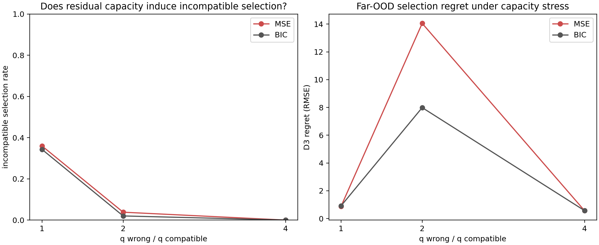

# Results — Model Capacity / Residual Stress Test v1

**Status:** development result; protocol frozen before execution  
**Protocol:** [RESIDUAL_CAPACITY_STRESS_PROTOCOL_V1.md](RESIDUAL_CAPACITY_STRESS_PROTOCOL_V1.md)  
**Code:** `experiments/residual_capacity_stress_v1.py`  
**Records:** `results/residual_capacity_stress_v1/results.json`  
**Design:** 2,700 inherited base tasks × matched/2×/4× incompatible-candidate
capacity = **8,100 capacity cases**.

## Question

Does flexible residual capacity cause pseudo-OOD MSE to select structurally
incompatible priors more often, while complexity-aware BIC resists that error?

## Primary result: the proposed incompatibility-masking mechanism was not supported

| Wrong/compatible capacity ratio | MSE incompatible selection | BIC incompatible selection | MSE D3 regret | BIC D3 regret |
|---|---:|---:|---:|---:|
| 1× (matched) | 36.0% | 34.3% | .874 [.819, .934] | .910 [.857, .969] |
| 2× | 3.8% | 2.0% | 14.052 [10.706, 17.594] | 7.986 [5.507, 10.761] |
| 4× | 0.0% | 0.0% | .565 [.516, .618] | .571 [.523, .621] |

Contrary to the hypothesized failure mode, increasing the polynomial residual
capacity did **not** make an incompatible candidate more likely to win
pseudo-OOD MSE. The flexible residual was already harmful on the near-boundary
selection problem often enough that both selectors rejected those candidates.

## What did happen

At 2× capacity, the few selections that survived the pseudo-OOD screen had
catastrophically high D3 regret. BIC reduces that regret relative to MSE
(`14.052 → 7.986`) and chooses incompatible priors less often, but it does not
make the polynomial residual architecture safe. At 4×, both rules reject the
high-capacity candidates; regret falls but remains above the capacity-matched
case.

The selected residual/pior norm ratio is only about `.07` on pseudo-OOD on
average, yet residual correction changes the prior first-difference direction
about `.31` of the time. Thus a small value-scale correction can still alter a
structural trajectory diagnostic. This is a mechanism record, not proof of
causality for all residual architectures.

## Supported and unsupported claims

**Supported:** in this fixed polynomial-residual stress test, residual capacity
is a distinct distance-sensitive realization risk; a complexity penalty reduces
the most extreme failure at 2× capacity.

**Not supported:** the general claim that MSE rewards incompatible structural
priors merely because they have more residual parameters. This particular
implementation instead makes high capacity visibly poor near the boundary.
The conclusion may differ for splines, neural corrections, another ridge scale,
or a different pseudo-OOD band and should not be generalized without those
tests.

## Figure

## Consequence

E3 should not rely on an unproven “MSE selects wrong prior through residual
masking” story. Its independent question remains valid: how specific can a
prior be before the available evidence is insufficient to support it?
