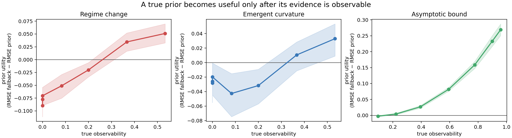
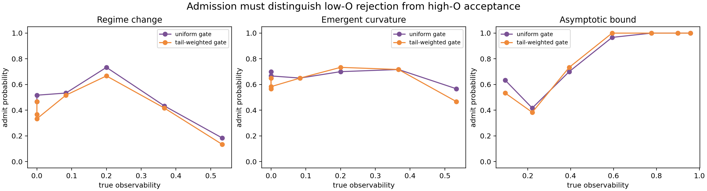
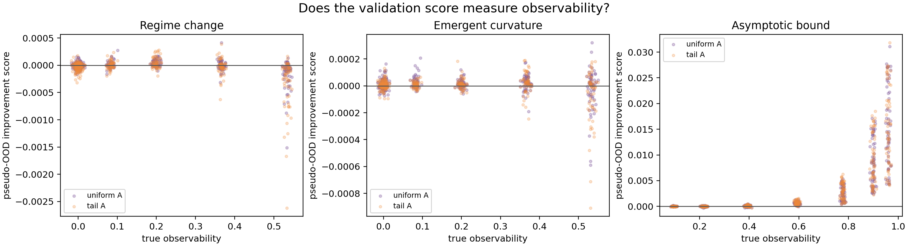

# Generic prior observability sweep v1 — result record

## Status

**Development evidence.** This folder intentionally contains no LLM call, RAG,
domain dataset, or PP-X component. It tests a generic prerequisite: whether a
structural prior is usable at the current observation boundary.

## Frozen design

- Seed: `20260919`; 1,260 trajectories total (3 generic families × 7 levels × 60).
- Noisy prefix: `t <= 0.60`, Gaussian SD `.015`.
- Far-OOD endpoint: clean `t > 0.70`; no selector accesses it.
- The **generative-family oracle** means only the matching family is known; its
  parameters are fit from the observed prefix. It is not a full-information oracle.
- Generic family labels: `regime_change`, `emergent_curvature`,
  `asymptotic_bound`.
- Utility: `RMSE(linear fallback) − RMSE(matching family prior)`. Positive is good.

## Primary result — observability governs utility

| Generic structure | Spearman(O, utility) | Low/zero-observability utility | Highest-observability utility | Result |
|---|---:|---:|---:|---|
| Regime change | **0.568** | -0.0705 to -0.0898 | +0.0511 | sign flip |
| Emergent curvature | **0.346** | -0.0197 to -0.0282 | +0.0329 | sign flip |
| Asymptotic bound | **0.943** | -0.0025 | +0.2691 | strong monotone increase |
| Pooled | **0.739** | — | — | positive relationship |

The matched prior is harmful when the mechanism is absent from the prefix and
becomes helpful after enough evidence is visible. This replicates the key
problem definition across three non-domain-specific structural families.

## Admission diagnostic — not solved

Two prefix-only gates were fixed before running:

- **Uniform:** equal average pseudo-OOD MSE improvement across three chronological windows.
- **Tail-weighted:** the same improvement with fixed weights `.10/.25/.65` toward the boundary.

| Diagnostic | Uniform | Tail-weighted | Interpretation |
|---|---:|---:|---|
| Reject rate where O=0 (n=360) | 42.2% | 50.6% | tail weighting helps, but both leave many harmful priors admitted |
| Score–O, regime change | -0.155 | -0.123 | failure / wrong direction |
| Score–O, emergent curvature | +0.069 | +0.044 | almost no discrimination |
| Score–O, asymptotic bound | +0.908 | +0.922 | strong success |

At high regime-change observability (O=.533), uniform and tail gates admitted
only 18% and 13% of useful priors, respectively. Thus neither is a general
admission solution; they are diagnostic baselines. The negative result is
retained because it demonstrates that prefix validation must represent the
mechanism’s evidence geometry, not merely chronological prediction error.

## Five-method comparison

The complete level-wise metrics are in
[results.json](results/generic_observability_sweep_v1/results.json). Avoid
ranking methods only by their all-level average: it would hide the sign flip
that this experiment is designed to expose. The relevant comparison is
conditional on observability.

Examples from the two ends of each sweep:

| Family / observability | Fallback RMSE | Matched prior RMSE | Uniform gate RMSE | Tail gate RMSE |
|---|---:|---:|---:|---:|
| Regime change, O=0 | 0.0117–0.0283 | 0.0988–0.1015 | 0.0473–0.0558 | 0.0362–0.0526 |
| Regime change, O=.533 | 0.1509 | **0.0998** | 0.1441 | 0.1474 |
| Curvature, O=0 | 0.0110–0.0373 | 0.0369–0.0571 | 0.0352–0.0531 | 0.0362–0.0550 |
| Curvature, O=.533 | 0.1094 | **0.0765** | 0.0970 | 0.1044 |
| Asymptotic bound, O=.095 | **0.0054** | 0.0080 | 0.0076 | 0.0070 |
| Asymptotic bound, O=.959 | 0.2729 | **0.0038** | 0.0038 | 0.0038 |

## Decision record

| Claim | v1 decision | Why |
|---|---|---|
| Generic prior truth does not imply utility | **supported** | harmful low-O and useful high-O regions in all three families |
| Observability predicts utility | **supported** | positive family-level and pooled associations |
| Uniform pseudo-OOD admits usable priors | **not established** | fails regime-change and curvature discrimination |
| Boundary-weighted pseudo-OOD fixes admission | **not established** | improves zero-O rejection but rejects many high-O regime-change priors |
| Ready for retrieval/RAG | **no** | candidate admission is not reliable enough yet |

## PPT-ready takeaway

> “The question is not whether a prior is scientifically plausible. The question
> is whether its distinguishing evidence is already observable at the current
> extrapolation boundary.”

Use the figures in this order: `fig04_experiment_logic` → `fig01` → `fig02` or
`fig03`. Their captions and claim limits are maintained in
[PPT_STORYBOARD.md](PPT_STORYBOARD.md).
